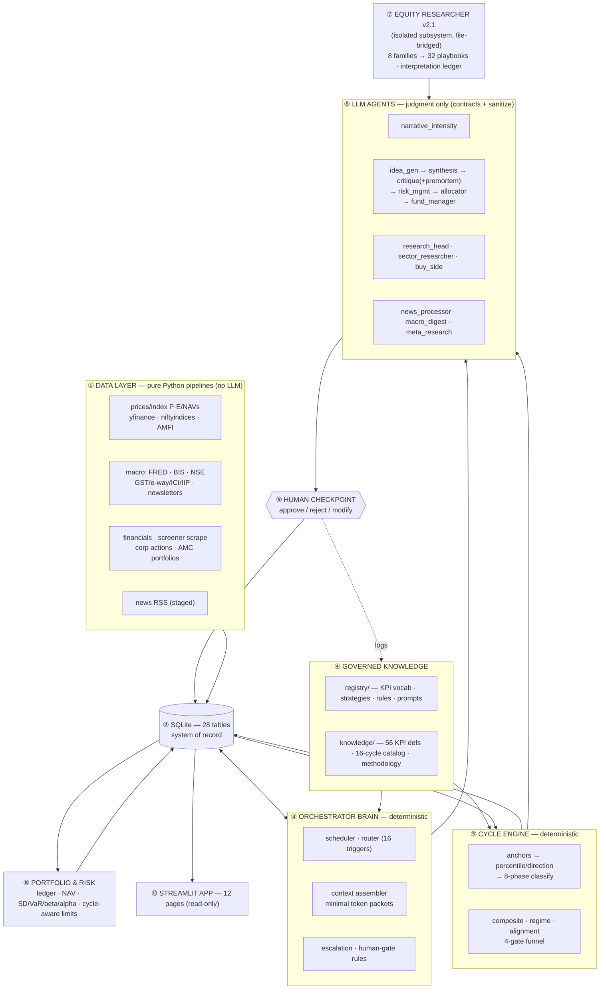

# AI-Native Fund — Architecture (one-pager)

**What it is.** A human-in-the-loop investment research & decision-support system for India-focused, long-only, multi-asset investing (stocks, ETFs, index funds, MFs). A **deterministic Python "brain"** does all data, orchestration, scheduling and math; **LLM agents reason only at explicit judgment nodes** (tiered haiku→sonnet→opus); **every capital decision halts at a human checkpoint**. Manual-first (nothing is auto-scheduled), paper portfolio (₹10L, no real money, no broker), and every framework threshold is DRAFT until back-tested. Strategy spine: Howard Marks cycle-positioning + a buy-side EPS-bridge doctrine.

## Architecture map

## Sub-components — responsibility · dependencies

| # | Component | Responsibility | Depends on |
|---|---|---|---|
| ① | **Data pipelines** (`src/afund/data/`) | ~19 pipelines fetch prices, index P/E, NAVs, financials (screener), macro (FRED/BIS/NSE/govt), news, newsletters, AMC portfolios → upsert to DB. Idempotent, job-logged, degrade honestly. | External free sources; `http.py` session; `base.py` Pipeline ABC |
| ② | **SQLite DB** (`db/`, 28 tables) | Single system-of-record: market/fundamentals/macro/news + portfolio + decisions + memory + `agent_runs` cost ledger. | schema.sql, additive migrations |
| ③ | **Orchestrator brain** (`orchestrator/`) | Deterministic scheduler/router (16 triggers), **minimal-context packet assembler** (token frugality), escalation rules, human-gate. No LLM loop. | DB, registry rules, knowledge |
| ④ | **Registry + Knowledge** (`registry/`, `knowledge/`) | Governed source-of-truth: KPI vocabulary, strategy defs, risk limits, EPS-bridge + **interpretation frames** (12-token conditioning vocabulary, 5 discriminator types, 8 family frames), agent prompts (registry); 56 machine KPI defs, 16-cycle catalog, EPS-bridge & facts-vs-interpretation methodology prose (knowledge). All DRAFT-flagged. | — (human-authored, git-versioned) |
| ⑤ | **Cycle engine** (`cycles/`) | Encodes the strategy constitution (`cycle_framework.yaml`): per-cycle anchor → percentile/direction/momentum → 8-phase → regime cluster + composite + alignment; 4-gate security funnel; allocation bands. Pure Python. | DB (index/macro series), framework yaml, knowledge catalog |
| ⑥ | **LLM agents** (`.claude/agents/`, 13) | Reason at judgment nodes only: news→table, newsletter→macro notes, narrative scoring, idea→synthesis→critique(+pre-mortem)→risk→allocator→fund-manager, sector research, buy-side, meta-research. Tiered haiku/sonnet/opus. | Packets from brain; `contracts.py` (validate) + `sanitize.py` (injection defense) |
| ⑦ | **Equity Researcher v2.1** (`research/equity_researcher/`) | Isolated sub-agent system: ticker→documents→3-level statement→EPS-bridge check→Excel→dossier+note+valuation handoff→styled .docx. v2.1 adds two-tier sector routing (8 tier-1 router packs → 32 tier-2 playbooks, `config/sector_registry.yaml`), thesis synthesis + red-team (18-check opinion audit), and the **interpretation ledger**. Own agents/CLAUDE.md; fund bridges by **files only** via `er_adapter`. | disclosure_fetcher; deterministic tools; fund registry (generates its packs/thresholds) |
| ⑧ | **Portfolio & risk** (`portfolio/`) | Paper ledger (avg-cost), daily NAV mark-to-market, risk snapshot (SD, hist-VaR, beta, Jensen's alpha, drawdown, HHI), cycle-aware position limits. | DB prices/NAVs/transactions |
| ⑨ | **Human checkpoint** | The non-skippable gate: every NEW/ADD/REDUCE/EXIT + checklist-FAIL escalates; decision logged with registry version. | escalation rules |
| ⑩ | **Streamlit app** (`dashboard/`, 12 pages) | Read-only views + click-gated idea/refresh buttons: positions, risk, macro/micro KPI, cycle wheel, ideas, ER reports, buy-side heatmap, news, ops, decisions, company-fit. | DB (read); CLI subprocess for jobs |

## How it interconnects — the two pipelines

**A. Top-down + bottom-up → decision (the fund pipeline)**
`daily_data` fills the DB → `weekly_cycle_assessment` runs the cycle engine (regime, composite, allocation band) + narrative scoring → `weekly_idea_cycle`: **4-gate funnel** (sector cycle phase → quality → own-history percentile → neglect) ranks candidates → **idea_gen → synthesis → critique (+ pre-mortem) → risk_mgmt (cycle-aware) → allocator (bands) → fund_manager** → **HUMAN** approves/rejects → logged to `decision_log`. The brain assembles a minimal token packet at each hop; contracts validate every output; nothing sizes a position without the human.

**B. Ticker → deep research → buy-side (the research pipeline)**
`equity_research_kickoff` → **disclosure_fetcher** pulls filings by ticker name → ER runs INTAKE→CONVERT→TRIAGE→**BIZMODEL** (the spine)→EXTRACT→COMPUTE (ratios, 3-level statement, **EPS-bridge check**, KPIs, Excel)→ANALYZE→RESEARCH↺→SYNTHESIZE→VERIFY→RENDER→FORMAT (.docx) → `valuation_handoff.json` → **buy_side** agent (cycle-aware) turns it into a rerating call + 5×5 sensitivity heatmap. This feeds gate-2 fundamentals back into pipeline A.

**C. Facts vs interpretation (cuts across both).** A *fact* is a published quantity or a disclosed mechanism; a *reading* is `fact + conditioning variable + sector convention → verdict`. A P/E of 30 is expensive on `own_history_anchor` and cheap on `growth_rate` — same number, both defensible — and what settles it must be one of four discriminator types (historical distribution, peer distribution, disclosed mechanism, dated forward observable) or the divergence is recorded unresolved and carried as a **disclosed load-bearing assumption**. Governed vocabulary: `registry/rules/interpretation_frames.yaml` (12 conditioning variables, 5 discriminator types, 8 family frames, all DRAFT), mirrored by the ER `config/sector_registry.yaml` and one-way-checked by `scripts/check_interpretation_frames.py`. `src/afund/research/interpretation.py::resolve_frame()` layers family-then-playbook and puts `interpretation_frame` into both the buy-side and sector packets; `contracts.py` (`FactClaim`/`Reading`/`DivergenceCase`) rejects a divergence declared resolved with nothing resolving it; critique runs the 18-check audit. Prose tier: `knowledge/references/methodology/facts_vs_interpretation.md`.

**Cross-cutting:** every agent gets the security preamble + sanitized inputs; every LLM call logs tokens/cost to `agent_runs`; the **meta-research** loop reviews the decision log quarterly and proposes (never applies) registry/prompt changes; memory (5 stores) feeds precedent back into future packets.

## Planned but NOT done (remaining)

| Item | Status / why | Unblocks |
|---|---|---|
| **Playwright install** (~200MB, one-time) | **Deferred by user** — the headline full-scale gap | VAHAN vehicle registrations + HDFC/SBI/Kotak AMC portfolio scraping (all JS/bot-walled) |
| **AMC portfolio *processing*** | Downloads work (Nippon live); Excel **parsing not built** — user to spec later | MF look-through / holdings concentration |
| **Full-universe screener scrape** | Staged (~100 names/run, ~7–8 runs); ~46/751 have fundamentals so far | flips company-fit `data_gap` → live; funnel quality gate |
| **EPFO / NPCI (UPI, FASTag) / PPAC / power / rail / steel / DGCA macro** | WAF-blocked (EPFO), 403 (NPCI), or PDF/JS-only → **manual-import paths documented**, not scripted | fuller GDP-business / consumption composite |
| **Live ER run on a real ticker** | Pipeline wired; KPITTECH docs staged (75MB) — no run executed yet | first real dossier + valuation handoff + gate-2 fundamentals |
| **`mcp_gdp` (Mcap/GDP)** unsourced | GDP series manual; gdp_business cycle stays `data_pending` (has GST/ICI supplementary anchors) | promote gdp_business to a fully live cycle |
| **Calibration data** (external expert decisions) | User to supply | benchmarks fund_manager + meta-research; Brier scoring |
| **Strategy threshold calibration / back-testing** | All `cycle_framework.yaml` + EPS-bridge thresholds are **DRAFT** | turns DRAFT bands into approved policy |
| **API backend + scheduling** | Claude Code backend is default (no key); Task Scheduler script dormant | unattended runs at scale |
| **CPI freshness** | FRED India CPI lags ~15mo → inflation cycle reads `data_stale`; MOSPI manual is the fresh route | live inflation cycle |

**Current state:** 11 build phases + downloaders + EPS-bridge + govt macro + ER v2.1 + facts/interpretation layer all committed; 687 tests + 1 skip green; `scripts/wiring_check.py` = 152/152 PASS. First live decision on record: KPITTECH **MONITOR_ONLY** (system refused to trade on price alone — waiting on fundamentals).

*See also: `docs/SYSTEM_MAP.md` (module map + data-availability table), `docs/RUNBOOK.md` (manual commands), `CLAUDE.md` (conventions).*
