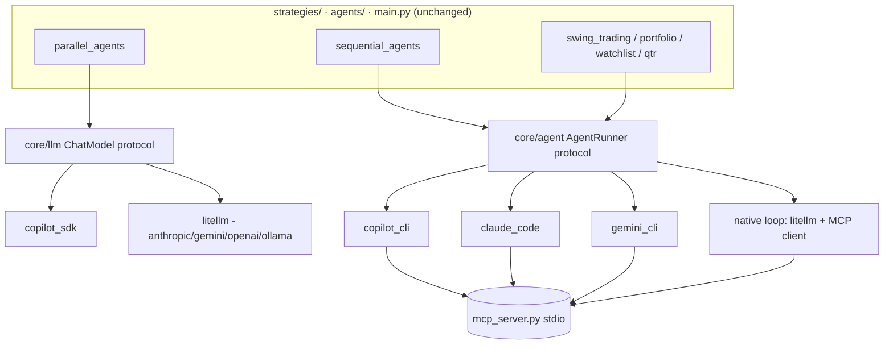
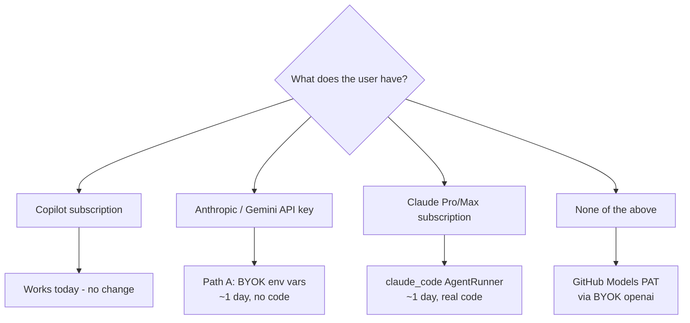

# Making the Stock Research System Provider-Agnostic

**Goal:** one clone of this repo runs for (a) a GitHub Copilot user, (b) a Claude Code user,
(c) a user holding nothing but a Gemini API key — without forking, without `if provider ==`
scattered through strategies.

> **⚠ Read Part II first.** Part I below was written before I inspected the installed Copilot
> SDK. The SDK and CLI support **BYOK (bring your own key)**, which solves the immediate
> problem with *zero code changes* and demotes most of Part I to optional hardening.
> Part I is retained because its analysis of the coupling surfaces is still correct and still
> drives the long-term plan.

---

## 1. What we're actually coupled to

The critical finding: **this repo does not have one Copilot dependency, it has two, and they
are architecturally different problems.** Any plan that treats "swap the LLM" as a single task
will fail on the second one.

### Surface A — Chat completion (easy)

`core/llm.py` → `CopilotLLM.invoke(messages) -> CopilotResponse(.content)`

| Consumer | Call |
|---|---|
| `agents/investor_agents.py:358` | `response = llm.invoke(messages)` |
| `agents/portfolio_manager.py:235` | `response = llm.invoke(messages)` |
| `strategies/parallel_agents.py:88` | `get_llm()` and pass down |

This is prompt-in / text-out. The consumers already defensively do
`response.content if hasattr(response, "content") else str(response)`, so the contract is
effectively LangChain's `BaseChatModel`. **Portable to literally any provider in a day.**

### Surface B — Agent harness (the hard part)

Two sub-flavours:

**B1 — In-process SDK agent loop.** `core/llm.py::run_copilot_prompt` + `copilot_tools()`
adapts LangChain tools into Copilot SDK `Tool` objects, creates a session, denies built-in
tools, and lets the model drive a tool-calling loop. Used by `main.py` (sequential 4-stage
research). Needs: a model with **tool/function calling** and a loop we own.

**B2 — Subprocess coding-agent CLI.** Four call sites shell out to the `copilot` binary:

| File | Entry point |
|---|---|
| `swing_trading_copilot.py:884` | `run_analysis()` |
| `portfolio_copilot_analysis.py` | `run_analysis()` |
| `watchlist_curator.py:569` | `invoke_copilot()` |
| `qtr_results/copilot_runner.py:55` | reuses `_resolve_copilot_bin` |

…wrapped by `strategies/swing_trading.py`, `portfolio_analysis.py`, `watchlist_curation.py`,
`qtr_results`. These depend on far more than a model:

```python
cmd = [copilot_bin,
       "-p", short_prompt,
       "--allow-all-tools",       # built-in file read  (prompt is handed over as a FILE)
       "--add-dir", str(tmp_dir),
       "-s",
       "--allow-all-urls",        # built-in web fetch/search grounding
       "--additional-mcp-config", f"@{scraper_cfg_file}",   # local stdio MCP server
       "--model", chosen_model]
```

So B2 requires: **file-read tool + web grounding + MCP client + streaming stdout + non-zero
exit handling.** A bare Gemini API key gives you none of that out of the box.

### The keystone asset you already have

`mcp_server.py` already exposes the scraper (screener.in fundamentals, yfinance, technical
indicators, news, NSE events) as a **stdio MCP server**. MCP is the one interface Copilot CLI,
Claude Code, Gemini CLI, and the Claude Agent SDK all speak. *Your tools are already portable —
only the harness is locked in.* This makes the plan far cheaper than it looks.

### Secondary blockers

1. **`github-copilot-sdk` is a hard dependency** in `pyproject.toml` and `requirements.txt`.
   The Claude Code friend is forced to install a SDK he can never authenticate.
2. **`tests/test_llm.py` imports `copilot.session_events` / `copilot.tools` at module scope.**
   The test suite is red on a machine without the SDK — CI is provider-locked too.
3. **`ui/pages.py:386-450`** hardcodes a "GitHub Copilot model" text box and a readiness table
   that probes `shutil.which("copilot")` / `find_spec("copilot")`.
4. **Rate limits.** `parallel_agents` fans out concurrently. A Gemini free-tier key
   (single-digit RPM) will 429 immediately. Copilot's host-managed quota hid this.
5. **`get_llm(temperature)` silently ignores temperature** — fine for Copilot, wrong for
   API providers where determinism matters for backtest reproducibility.

---

## 2. Recommended architecture

Two abstraction layers, because we have two problem classes. Do **not** try to force B2
through a chat-completion interface.



### Layer 1 — `ChatModel` (replaces `core/llm.get_llm`)

```python
# core/providers/base.py
from typing import Protocol, Sequence, Any
from dataclasses import dataclass

@dataclass(frozen=True)
class ChatResponse:
    content: str
    model: str
    input_tokens: int | None = None
    output_tokens: int | None = None

class ChatModel(Protocol):
    def invoke(self, messages: Any) -> ChatResponse: ...
    async def ainvoke(self, messages: Any) -> ChatResponse: ...
```

Keep `.content` so **zero changes** are needed in `investor_agents.py` /
`portfolio_manager.py`.

**Implementation choice: LiteLLM.** One dependency covers Anthropic, Gemini, OpenAI, Azure,
Bedrock, Vertex, Ollama, OpenRouter — including a normalised tool-calling schema and
`google_search` / `web_search` server-tool passthrough. It also gives production essentials we
currently lack: retries, per-provider fallback chains, budget caps, and a token/cost callback.

> Alternative considered: **Pydantic AI** — stronger typing and validated structured output,
> better if we later want the analyst verdicts as validated models rather than markdown.
> **LangChain `init_chat_model`** — we already carry `langchain`, but it drags a provider
> package per vendor and duplicates what LiteLLM does more cleanly.
> **Recommendation: LiteLLM now**, and revisit Pydantic AI when `agents/models.py` outputs
> become schema-enforced.

### Layer 2 — `AgentRunner` (new, this is the real work)

```python
# core/agent/base.py
@dataclass(frozen=True)
class AgentRequest:
    prompt: str                      # long markdown prompt (today written to a temp file)
    mcp_servers: dict[str, dict]     # canonical MCP config; adapters translate
    allow_web: bool = True
    model: str | None = None
    timeout: float = 900.0
    workdir: Path | None = None

@dataclass(frozen=True)
class AgentResult:
    text: str
    tool_calls: int
    raw_log_path: Path | None

class AgentRunner(Protocol):
    capabilities: Capabilities
    def run(self, req: AgentRequest) -> AgentResult: ...
```

**Capabilities are declared, not assumed:**

```python
@dataclass(frozen=True)
class Capabilities:
    tool_calling: bool
    web_grounding: bool
    mcp_stdio: bool
    file_read: bool
    streaming: bool
    concurrency_limit: int | None
```

Strategies declare what they need; the registry pre-flights and either degrades or fails fast
with an actionable message ("swing_trading needs web grounding; `gemini_cli` has it, your
selected `native` backend needs `GEMINI_ENABLE_SEARCH=true`").

### The four adapters

| Adapter | Backend | Prompt delivery | MCP | Web grounding | Effort |
|---|---|---|---|---|---|
| `copilot_cli` | existing subprocess | temp file + file-read tool | `--additional-mcp-config` | `--allow-all-urls` | already done, just extract |
| `claude_code` | `claude -p` headless, or `claude-agent-sdk` (Python, in-process) | stdin / `ClaudeAgentOptions` | `--mcp-config` / `mcp_servers={...}` | built-in `WebFetch`/`WebSearch` | S |
| `gemini_cli` | `gemini -p` non-interactive | stdin | `settings.json` `mcpServers` | built-in google search | S–M |
| `native` | **in-process loop over LiteLLM + a Python MCP client** | messages array | we act as MCP host | provider server-tool (`google_search` / `web_search`) | **M–L — the critical one** |

`native` is what unblocks the Gemini-API-key-only friend. It is also what lets this run in CI,
in a container, or on a server where no coding-agent CLI is installed — which is exactly what
"production grade" means here. Sketch:

```python
# core/agent/native.py  (~200 lines)
class NativeAgentRunner:
    """Own the agent loop: LiteLLM for reasoning, MCP stdio for tools."""
    def run(self, req):
        tools = self.mcp.list_tools()                    # from mcp_server.py, schema-converted
        if req.allow_web:
            tools += self.provider.web_search_tool()     # google_search | web_search_*
        messages = [{"role": "user", "content": req.prompt}]   # no file-read hop needed
        for _ in range(self.max_turns):
            resp = litellm.completion(model=..., messages=messages, tools=tools)
            if not resp.tool_calls:
                return AgentResult(text=resp.content, ...)
            messages += self.mcp.execute(resp.tool_calls)      # parallel, rate-limited
        raise AgentBudgetExceeded(...)
```

Note the prompt no longer needs the "read this file with your file-read tool" indirection that
`swing_trading_copilot.py:914` uses — `native` passes it directly, which is *more* reliable.

### Configuration surface

```ini
# .env — one variable decides everything
AI_PROVIDER=copilot        # copilot | claude | gemini | openai | ollama
AI_AGENT_BACKEND=auto      # auto | copilot_cli | claude_code | gemini_cli | native
AI_MODEL=                  # blank -> per-provider sane default
AI_TIMEOUT=300
AI_MAX_CONCURRENCY=4       # NEW: throttles parallel_agents fan-out per provider tier

ANTHROPIC_API_KEY=
GEMINI_API_KEY=
OPENAI_API_KEY=
```

`AI_AGENT_BACKEND=auto` resolves by detection: authenticated `copilot` on PATH → `copilot_cli`;
else `claude` on PATH or `ANTHROPIC_API_KEY` → `claude_code`; else `gemini` on PATH →
`gemini_cli`; else any API key → `native`; else a clear setup error. **Your three friends each
clone and run with zero code edits** — the Gemini friend just sets two variables.

Keep `COPILOT_MODEL` / `COPILOT_TIMEOUT` / `COPILOT_BIN` working as deprecated aliases so
existing `.env` files and the four CLI `--model` flags don't break.

---

## 3. Phased action plan

### Phase 0 — Unblock immediately (½ day, no architecture)

Ships value before any refactor lands.

1. Move `github-copilot-sdk` out of core deps into `[project.optional-dependencies]`:
   ```toml
   copilot = ["github-copilot-sdk>=1.0.8"]
   claude  = ["claude-agent-sdk>=0.1"]
   api     = ["litellm>=1.50"]
   all     = ["stock-market-researcher[copilot,claude,api]"]
   ```
   Mirror in `requirements.txt`. Friends install `uv pip install -e ".[claude]"`.
2. Make `tests/test_llm.py` skip cleanly: `pytest.importorskip("copilot")` at module top.
   Green suite on every machine is a hard prerequisite for everything below.
3. `README.md`: three quickstart blocks (Copilot / Claude Code / Gemini key) so expectations
   are set even before the code supports all three.

### Phase 1 — Layer 1, chat completion (1–2 days)

4. Create `core/providers/` (`base.py`, `copilot.py`, `litellm_provider.py`, `registry.py`).
5. Rewrite `core/llm.py` as a **thin backwards-compatible shim** re-exporting `get_llm`,
   `CopilotLLM`, `CopilotResponse`, `DEFAULT_COPILOT_MODEL`. Nothing else in the repo changes.
6. Honour `temperature` where supported (fixes the silent-drop; matters for backtests).
7. Add `tests/test_provider_contract.py` — one parametrised suite every adapter must pass,
   plus a `FakeProvider` so CI needs **no credentials**.

**Exit criteria:** `parallel_agents` runs end-to-end on a Gemini API key alone.

### Phase 2 — Layer 2, agent harness (3–5 days, the bulk)

8. `core/agent/` with `base.py` + `copilot_cli.py` (extract the existing subprocess logic,
   behaviour-identical) + `detect.py`.
9. Refactor the four call sites (`swing_trading_copilot.run_analysis`,
   `portfolio_copilot_analysis.run_analysis`, `watchlist_curator.invoke_copilot`,
   `qtr_results/copilot_runner.py`) to build an `AgentRequest` and call
   `get_agent_runner().run(req)`. Delete `_resolve_copilot_bin` duplication (it is currently
   copy-pasted across three files).
10. Move `_write_scraper_mcp_config` into `core/agent/mcp.py` as the **canonical** MCP config,
    with per-adapter translation. Single source of truth for `mcp_server.py` wiring.
11. Add `claude_code.py` and `gemini_cli.py` adapters.
12. Add `native.py` — the in-process LiteLLM + MCP loop. Include a turn budget, a token budget,
    and `AI_MAX_CONCURRENCY` throttling.
13. Golden-output regression: capture today's Copilot report for a fixed portfolio, then assert
    each new backend produces a report with the same *sections* (not the same prose).

**Exit criteria:** `python run.py swing_trading` produces a usable report on all four backends.

### Phase 3 — Product polish (1–2 days)

14. `ui/pages.py::settings_page` → provider-aware: dropdown of **detected** providers, key
    status per provider (present / valid / missing), model picker, **Test connection** button,
    and per-provider capability badges. Removes the Copilot-only readiness table.
15. `core/run_history.py`: record provider + model + token counts + estimated cost per run, so
    the three of you can compare output quality and spend across providers on the same input.
16. Prompt-portability pass on `prompts.py` and the templates — strip Copilot-CLI-specific
    phrasing ("use your file-read tool"), which `native` doesn't need and Gemini interprets
    differently.

### Phase 4 — Optional, if this becomes a shared service

17. Stand up a **LiteLLM proxy** (one OpenAI-compatible base URL, central keys, budgets,
    per-user rate limits, audit log). Then `AI_PROVIDER=openai` + `AI_BASE_URL=<proxy>` is the
    only config any teammate needs, and no API key ever touches a laptop. Overkill for three
    friends; correct if this grows past ~5 users or gets deployed.

---

## 4. Risks and how we handle them

| Risk | Impact | Mitigation |
|---|---|---|
| Prompts tuned for Copilot degrade elsewhere | Silent quality loss, not a crash | Phase 3 #16 + golden-section regression (#13). Compare on identical portfolios via #15. |
| Gemini free-tier RPM limits | 429s under `parallel_agents` fan-out | `AI_MAX_CONCURRENCY`, LiteLLM retry/backoff, provider-declared `concurrency_limit`. |
| No web grounding on a raw API key | Reports fall back to stale model knowledge | Map to provider server-tools (`google_search`, `web_search`); if unavailable, `native` still has `mcp_server.py` scrapers — degrade loudly, never silently. |
| API cost, previously zero under Copilot | Bill shock | Token accounting in `run_history` + LiteLLM budget caps + a `--dry-run` token estimate. |
| Four adapters = 4× maintenance | Drift, "works on my provider" | Shared contract test suite (#7) is mandatory for every adapter; nightly matrix run. |
| Big refactor breaks a working app | Regression | Backwards-compatible shims (#5), behaviour-identical extraction first (#8), `copilot_cli` remains the default until parity is proven. |

## 5. Effort summary

| Phase | Scope | Effort |
|---|---|---|
| 0 | Optional deps, test skips, docs | **0.5 d** |
| 1 | ChatModel abstraction + LiteLLM | **1–2 d** |
| 2 | AgentRunner + 4 adapters | **3–5 d** |
| 3 | UI, telemetry, prompt portability | **1–2 d** |
| 4 | LiteLLM proxy (optional) | 1 d |

**~6–10 working days for full multi-provider support.** Phases 0 + 1 alone (≤2.5 days) already
get the Gemini-key friend running `parallel_agents`, and get the Claude Code friend a clean
install.

## 6. The one-line answer to "is there a better production-grade solution?"

Yes: **stop treating "the model" as one dependency.** Split it into a `ChatModel` port
(satisfied by LiteLLM for every API provider) and an `AgentRunner` port (satisfied by whichever
coding-agent CLI the user has, or by an in-process loop when they have none). Because your
tools already live behind MCP in `mcp_server.py`, the second port is a translation layer rather
than a rewrite — which is why this is a ~1–2 week job and not a rebuild.

---
---

# Part II — LangChain / Semantic Kernel over Copilot, and the BYOK discovery

Three questions were asked. Short answers first, evidence after.

| Question | Answer |
|---|---|
| Can I use LangChain/SK as the agent library with **GHCP as a chat-completions provider**? | **Partially.** You can wrap Copilot as a text-only `BaseChatModel` in ~100 lines. You **cannot** get provider-native tool calling out of it — Copilot never returns `tool_calls` to the client, so a LangChain/SK agent loop has nothing to drive. |
| Is there a **specific GHCP agent feature** we depend on? | **No unique algorithm.** We use a tool-calling loop, MCP hosting, built-in web/file tools, and a permission model — all reproducible. The one thing that is *not* reproducible is **host-managed auth + zero-marginal-cost quota**. That's the real lock-in. |
| The SDK repo is open — can we **copy it over**? | **There is nothing useful to copy.** The MIT-licensed SDK contains **no model call and no agent loop**. It is a JSON-RPC client to a **closed-source runtime binary**. Copying it yields a client for a program you must still install. |

**But the investigation surfaced something much better than any of the three, see §9.**

---

## 7. Why an external agent framework can't sit on top of Copilot

### Copilot gives you an *agent*, not a *model*

I enumerated every public method on the installed SDK
(`.venv/Lib/site-packages/copilot/`). The **only** inference entry points are:

```
CopilotSession.send(...)          # fire a turn
CopilotSession.send_and_wait(...) # fire a turn, await the assistant message
```

There is no `complete()`, no `chat()`, no `/chat/completions`. `client.py` (188 KB) issues
**zero** model HTTP requests — it only speaks JSON-RPC. The prompt assembly, the tool-calling
loop, the retry logic and the web grounding all execute **inside the closed CLI runtime**.

### The two-loops problem — this is the blocker

LangChain (`AgentExecutor`, LangGraph) and Semantic Kernel (`FunctionChoiceBehavior.Auto()`)
are built on one assumption:

> the model **returns** a list of `tool_calls`; **the framework** executes them and feeds
> results back.

Copilot inverts this. You *register* tools at session creation and the **runtime** calls your
handler:

```python
# core/llm.py:209 — we hand over a callback; we never receive a tool_call to dispatch
Tool(name=..., parameters=..., handler=handler, skip_permission=True, defer="never")
```

I checked whether `defer` could be used to intercept calls — it cannot. Per the SDK docstring
(`tools.py:182`) `defer` controls **lazy loading via tool search**, not deferred execution.
There is no "return the tool call to me instead of executing it" mode.

**Consequence:** put LangChain on top of Copilot and both layers want to own the loop.
Your options degrade to:

1. Let Copilot own the loop → LangChain contributes nothing but a type wrapper. *Pointless.*
2. Use Copilot text-only and re-implement tool calling by asking for JSON in the prompt →
   loses schema validation, parallel calls, and retry-on-malformed. *Strictly worse than what
   `core/llm.py` does today.*

### Where a LangChain wrapper *is* genuinely worth it

For **Surface A only** (`investor_agents`, `portfolio_manager` — text in, text out, no tools),
a `ChatCopilot(BaseChatModel)` is a clean win: it makes Copilot interchangeable with
`ChatAnthropic` / `ChatGoogleGenerativeAI` behind one interface you already depend on
(`langchain` is in `pyproject.toml`).

```python
class ChatCopilot(BaseChatModel):
    """Copilot SDK as a text-only LangChain chat model. Tools intentionally unsupported."""
    def _generate(self, messages, stop=None, **kw):
        text = asyncio.run(run_copilot_prompt(_to_prompt(messages), model=self.model))
        return ChatResult(generations=[ChatGeneration(message=AIMessage(content=text))])

    def bind_tools(self, tools, **kw):
        raise NotImplementedError(
            "Copilot executes tools inside its runtime; use AgentRunner for tool flows."
        )
```

That explicit `NotImplementedError` is the important part — it makes the architectural
boundary a compile-time fact instead of a runtime surprise.

### Semantic Kernel: not recommended here

Same two-loops problem, plus: it's .NET-first (Python SK trails), it would be a *second* agent
framework alongside the `langchain` you already ship, and it buys nothing this repo needs.
Its planners/skills model is aimed at enterprise orchestration you don't have. **Skip it.**

### The one way to get real GHCP chat completions: GitHub Models

`https://models.github.ai/inference` is an **officially OpenAI-compatible** endpoint
authenticated with a plain GitHub PAT. That *does* work natively with LangChain, including
tool calling:

```python
ChatOpenAI(model="gpt-4o", api_key=GITHUB_PAT, base_url="https://models.github.ai/inference")
```

Caveat: it is **GitHub Models quota, not your Copilot subscription** — separate free tier,
lower rate limits, and not every model in `/models` is served over `/chat/completions`. Useful
as a free fallback tier; not a replacement for the Copilot agent.

---

## 8. What we actually use from the Copilot agent — and what's portable

Audited from our own call sites, not from the docs.

| Feature we use | Where | Is it GHCP-special? | Replacement |
|---|---|---|---|
| Tool-calling agent loop | `core/llm.py:242` `create_session(tools=...)` | No | LiteLLM loop, LangGraph, Claude Agent SDK |
| LangChain→SDK tool adapter | `core/llm.py:175` `copilot_tools()` | No | ~30 lines to OpenAI tool schema |
| Deny built-in tools | `core/llm.py:239` `PermissionDecisionUserNotAvailable` | Mildly | Just don't register them |
| Built-in **web grounding** | `--allow-all-urls` (4 CLI sites) | Somewhat | `google_search` / `web_search` server tools, or Tavily |
| Built-in **file read** | `--allow-all-tools --add-dir` | No | Unnecessary — pass the prompt inline |
| **MCP host** | `--additional-mcp-config` | No | `langchain-mcp-adapters` — **already a dependency** |
| Streaming stdout | `subprocess.Popen` pumps | No | Any streaming client |
| **Host-managed auth + quota** | `use_logged_in_user=True` | **YES — the real lock-in** | Nothing. This is the thing you're actually buying. |

**Verdict:** there is no proprietary reasoning capability here. Every *capability* is
replaceable; only the *commercial* property (no API key, no per-token bill) is not. That is
precisely why the answer to "can we copy it from the open-source SDK" is no — the open part is
the plumbing, the closed part is the value.

---

## 9. ⭐ The finding that changes the plan: Copilot CLI supports BYOK

While reading `copilot/generated/rpc.py` I found first-party BYOK types:

```python
class NamedProviderConfig:      # rpc.py:13982
    """A named BYOK provider connection (transport + credentials)."""
    base_url: str; name: str; api_key: str | None; bearer_token: str | None ...

class ProviderModelConfig:      # rpc.py:22014
    """A BYOK model definition referencing a named provider."""

class ProviderWireAPI(Enum):    # rpc.py:5031
    ANTHROPIC = "anthropic"; AZURE = "azure"; OPENAI = "openai"
```

…surfaced on `create_session(provider=..., providers=[...], models=[...])`, and
`CopilotClient(use_logged_in_user=False)` emits **`--no-auto-login`** (`client.py:3889`).

GitHub's own docs confirm the supported, env-var-driven form:

| Variable | Required | Meaning |
|---|---|---|
| `COPILOT_PROVIDER_BASE_URL` | Yes | Provider API endpoint |
| `COPILOT_PROVIDER_TYPE` | No | `openai` (default) · `azure` · `anthropic` |
| `COPILOT_PROVIDER_API_KEY` | No | Your key (omit for local Ollama) |
| `COPILOT_MODEL` | Yes | Model id — **we already read this variable** |
| `COPILOT_OFFLINE` | No | `true` blocks all GitHub network calls |

Requirements: the model must support **tool calling and streaming** (Claude and Gemini both
do), 128k+ context recommended.

### Why this is close to a total win for us

These are **environment variables read by the CLI at startup** — and *both* of our coupling
surfaces spawn that same CLI (`RuntimeConnection.for_stdio` in `core/llm.py:99`, and the four
`subprocess.Popen` sites). So BYOK flows through **the SDK path and the subprocess path
simultaneously, with no code change at all.** Even `--allow-all-urls` web grounding,
`--additional-mcp-config` scraper tools, and `mcp_server.py` keep working, because the harness
is unchanged and only the model behind it swaps.

**Your Claude friend:**

```bash
export COPILOT_PROVIDER_TYPE=anthropic
export COPILOT_PROVIDER_BASE_URL=https://api.anthropic.com
export COPILOT_PROVIDER_API_KEY=sk-ant-...
export COPILOT_MODEL=claude-opus-4-5
python run.py swing_trading
```

**Your Gemini-key friend** (Gemini ships an OpenAI-compatible surface):

```bash
export COPILOT_PROVIDER_TYPE=openai
export COPILOT_PROVIDER_BASE_URL=https://generativelanguage.googleapis.com/v1beta/openai/
export COPILOT_PROVIDER_API_KEY=AIza...
export COPILOT_MODEL=gemini-2.5-pro
python run.py swing_trading
```

Both still install the CLI (`npm install -g @github/copilot`) — but per GitHub's April 2026
changelog, **no Copilot subscription and no GitHub sign-in are required in BYOK mode.**

### Caveats — do not skip these

1. **Verify before committing.** The SDK marks these types *"Experimental: this type is part
   of an experimental API and may change or be removed."* I could not verify locally — this
   machine's CLI is missing its platform package (`copilot help providers` → *"no platform
   package found"*). **Have one friend confirm end-to-end before we build on it.**
2. **Still requires the closed-source CLI binary.** Anyone who won't install it — CI runners,
   slim containers, locked-down machines — is still blocked. That is exactly the gap Part I's
   `native` runner fills.
3. `COPILOT_MODEL` becomes overloaded: today it means "a Copilot-hosted model", under BYOK it
   means "a model id at my provider". Our `DEFAULT_COPILOT_MODEL = "claude-opus-4.7"` fallback
   (`core/llm.py:24`) will be **wrong** under BYOK — it must not be applied when
   `COPILOT_PROVIDER_BASE_URL` is set.
4. Rate limits and cost move onto the friend's own key — the `AI_MAX_CONCURRENCY` throttle and
   token accounting from Part I still matter for `parallel_agents` fan-out.

---

## 10. Revised recommendation

Two paths, sequenced. **Do Path A now; treat Path B as insurance, not urgency.**

### Path A — BYOK passthrough · ~1 day · unblocks both friends

| # | Task |
|---|---|
| A1 | **Have a friend validate BYOK end-to-end** on one strategy. Everything below is contingent on this. |
| A2 | `core/config.py`: add `byok_enabled()` = `bool(COPILOT_PROVIDER_BASE_URL)`. In `get_copilot_model()`, **suppress the `claude-opus-4.7` default when BYOK is on** and raise a clear error if `COPILOT_MODEL` is unset (caveat 3). |
| A3 | `validate_copilot_configuration()`: when BYOK is on, skip the `~/.copilot` login check — it's the wrong precondition and produces a misleading error. |
| A4 | Move `github-copilot-sdk` to an extra; make `tests/test_llm.py` use `pytest.importorskip("copilot")`. *(Phase 0 from Part I — still required.)* |
| A5 | `example.env` + `README.md`: three copy-paste blocks (Copilot / Anthropic BYOK / Gemini BYOK). |
| A6 | `ui/pages.py:386` readiness table: show provider type, base URL host, key present, resolved model — instead of today's Copilot-only probe. |

**Outcome:** all three of you run the same clone, unmodified, on your own credentials.

### Path B — `AgentRunner` + `native` runner · 3–5 days · only if Path A's caveats bite

Build Part I §2 Layer 2 **only** when you actually need: CLI-free CI, container deploys, or a
hedge against the experimental BYOK API changing. **Correction (see Part III): the
`claude_code` adapter is *not* redundant** — it is mandatory if the Claude friend has a
Pro/Max subscription rather than an API key. `gemini_cli` remains redundant.

### Explicitly not recommended

- ~~LangChain/LangGraph agent loop *on top of* Copilot~~ — two-loops problem (§7).
- ~~Semantic Kernel~~ — same problem, second framework, no benefit.
- ~~Copying the agent loop out of the open-source SDK~~ — it isn't in there (§7).
- ✅ *Do* add `ChatCopilot(BaseChatModel)` for Surface A if/when you want Part I's Layer 1 —
  it's cheap, honest, and composes with the LangChain you already ship.

### Revised effort

| Path | Scope | Effort | Priority |
|---|---|---|---|
| A | BYOK passthrough + config hygiene + docs | **~1 day** | **Do now** |
| Part I Ph.1 | `ChatModel` port + LiteLLM (Surface A) | 1–2 d | Nice-to-have |
| B | `AgentRunner` + `native` runner | 3–5 d | Only if A's caveats bite |
| Part I Ph.4 | LiteLLM proxy | 1 d | Only past ~5 users |

**Bottom line:** the honest answer to "can I put LangChain/SK over Copilot" is *no, not
usefully* — but you don't need to, because Copilot itself is already the multi-provider
abstraction you were about to build. **~1 day of config work replaces ~6–10 days of
refactoring**, provided A1 validates.


---
---

# Part III — "How does the Claude Code person actually use this?"

**It depends entirely on which of two different things he owns.** These are not
interchangeable, and BYOK only covers one of them. Ask him this before writing any code:

> *"Do you have an Anthropic **API key** from console.anthropic.com, or do you have Claude
> Code through a **Pro/Max subscription**?"*

| He has | BYOK works? | Path | Cost model |
|---|---|---|---|
| **Anthropic API key** (`sk-ant-api...`) | ✅ Yes | Path A — 4 env vars, zero code | Pay-per-token |
| **Claude Pro/Max subscription** (no key) | ❌ **No** | Needs `claude_code` adapter | Already paid; separate credit pool |

## Case 1 — He has an Anthropic API key

Works today, no code changes, keeps web grounding + `mcp_server.py` scraper tools:

```bash
export COPILOT_PROVIDER_TYPE=anthropic
export COPILOT_PROVIDER_BASE_URL=https://api.anthropic.com
export COPILOT_PROVIDER_API_KEY=sk-ant-api03-...
export COPILOT_MODEL=claude-opus-4-5
python run.py swing_trading
```

He still installs the Copilot CLI binary, but needs **no Copilot subscription and no GitHub
login**. Every strategy works — SDK path and all four subprocess paths.

## Case 2 — He has a Pro/Max subscription (the likely case, and BYOK does *not* cover it)

**Why BYOK fails here:** `COPILOT_PROVIDER_API_KEY` expects a real Anthropic API key. A
subscription gives you no such key — it gives an **OAuth credential** (`sk-ant-oat...`) that
only Anthropic's *own first-party* tooling is authorised to present. Two independent reasons
it won't work:

1. **Technical** — Copilot's `anthropic` wire API authenticates with the `x-api-key` header.
   The subscription credential is an `Authorization: Bearer` OAuth token on a different flow.
2. **Contractual** — since **April 2026** Anthropic explicitly prohibits using subscription
   credentials to authenticate *third-party* harnesses (this is what killed OpenClaw/OpenCode
   subscription auth). Copilot CLI is a third-party harness. Don't route around this.

**What does work: Anthropic's own Agent SDK / `claude -p`, which are first-party.** Per
Anthropic's support article *"Use the Claude Agent SDK with your Claude plan"* (last updated
**2026-06-16 — i.e. after the April crackdown**), subscription-authenticated programmatic use
is supported:

```bash
claude setup-token                 # one-time; issues sk-ant-oat..., ~1 year validity
export CLAUDE_CODE_OAUTH_TOKEN=sk-ant-oat...
unset ANTHROPIC_API_KEY            # if set, it WINS and silently bills pay-as-you-go
```

Terms to be aware of:

- **Personal use only.** Running this on his own machine for his own portfolio is squarely
  within it. Hosting it as a service for others is not.
- **Separate credit pool** (since 2026-06-15): programmatic use draws from a monthly
  programmatic allowance (~$20 Pro · ~$100 Max 5x · ~$200 Max 20x), **not** from his
  interactive Claude Code limits. So this won't eat the quota he uses for coding.
- **Credits are per-user and non-poolable.**

### The good news: this adapter is cheap because the two SDKs are the same shape

`claude-agent-sdk` is architecturally a near-twin of the Copilot SDK — it spawns a CLI, you
register tools, it hosts MCP servers, it ships built-in `WebFetch`/`WebSearch`. So it maps
almost 1:1 onto the `AgentRequest` contract, and **`mcp_server.py` plugs straight in**:

```python
# core/agent/claude_code.py  (~100 lines)
from claude_agent_sdk import query, ClaudeAgentOptions

class ClaudeCodeRunner:
    capabilities = Capabilities(tool_calling=True, web_grounding=True, mcp_stdio=True,
                                file_read=True, streaming=True, concurrency_limit=2)

    async def run(self, req: AgentRequest) -> AgentResult:
        options = ClaudeAgentOptions(
            mcp_servers={                      # same dict shape as our Copilot MCP config
                "indian-stock-data": {"type": "stdio", "command": sys.executable,
                                      "args": [str(REPO_ROOT / "mcp_server.py")]}
            },
            allowed_tools=["mcp__indian-stock-data__*", "WebFetch", "WebSearch"],
            model=req.model or "claude-opus-4-5",
        )
        chunks = [m async for m in query(prompt=req.prompt, options=options)]
        return AgentResult(text=_final_text(chunks), ...)
```

Note this also removes the awkward *"read this file with your file-read tool"* indirection at
`swing_trading_copilot.py:914` — the Agent SDK takes the prompt directly.

**Effort: ~1 day** — not the full 3–5 day Path B. It is the single highest-value slice of the
`AgentRunner` work, because it is the *only* way a Pro/Max user can run this repo at all.

## Case 3 — neither (worth naming)

If he has no key and no subscription: **GitHub Models** (`https://models.github.ai/inference`)
takes a plain GitHub PAT on a free tier and is OpenAI-compatible, so it works via BYOK
(`COPILOT_PROVIDER_TYPE=openai`). Lower rate limits, but a genuine zero-cost fallback.

## Revised decision tree

> **DECISION (confirmed by repo owner):** the Claude friend is on a **Pro/Max subscription
> with no API key**. Case 2 applies. The `claude_code` adapter is therefore **required work**,
> not optional. Path A alone does *not* unblock him.



## Updated priority

| # | Work | Effort | Trigger |
|---|---|---|---|
| 1 | ~~Ask both friends which credential they hold~~ | done | Claude friend = **Pro/Max, no key** |
| 2 | `AgentRequest`/`AgentRunner` contract + `copilot_cli` extraction | ~1 d | **Required** — prerequisite for #3 |
| 3 | `claude_code` adapter (`claude-agent-sdk` + `CLAUDE_CODE_OAUTH_TOKEN`) | ~1 d | **Required** — only way the Claude friend can run this |
| 4 | Path A (BYOK env vars + config hygiene + docs) | ~1 d | **Required** for the Gemini friend |
| 5 | `native` runner (LiteLLM + MCP) | 2–3 d | Later — CLI-free CI / containers |

**Total to unblock both friends: ~3 days.** Order matters — #2 first, because both #3 and a
future #5 hang off that contract, and doing #3 without it just adds a fifth bespoke call site
to the four we already have.

**Answer in one sentence:** if he has an API key, four environment variables and he's done; if
he has a Pro/Max subscription, BYOK cannot help him and he needs the ~1-day `claude_code`
adapter — which is exactly the adapter I wrongly marked redundant in §10.

---

# Part IV — "Do we end up with two copies of every agent?"

> **Question (repo owner):** does supporting both the Copilot SDK and the Claude SDK mean two
> implementations of every agent? Or can we extract agent/session actions into a generalised
> provider layer and run all logic on top of it, swapping the provider underneath?

**Answer: no duplication of agents, and yes — the generalised layer is exactly right.**
This section replaces the vaguer "`AgentRunner` port" sketch in §3 with a concrete contract,
because measuring the call sites changed how much I think this actually costs. It is *cheaper*
than the status quo, not more expensive.

## 12. There is no "agent implementation" to duplicate

This is the crux, and it is worth stating bluntly because it inverts the intuition behind the
question. Search the repo for an agent loop and you will not find one. What we call an "agent"
in this codebase is **three provider-neutral things**:

| Ingredient | Where it lives | Provider-specific? |
|---|---|---|
| The **prompt** | `build_full_prompt()` — a pure `str`-returning function | **No** — plain text |
| The **tools** | `mcp_server.py` — a stdio **MCP** server | **No** — MCP is a standard |
| The **result** | Markdown text on stdout | **No** — a string |

There is no tool-dispatch loop, no planner, no state machine, no memory store in our code. The
loop lives *inside* the vendor's runtime (this is the same finding as §8 — Copilot's loop is in
a closed binary; Claude's is inside `claude-agent-sdk`). **We never wrote one, so we have
nothing to port and nothing to duplicate.**

### Measured: how much of each call site is actually provider-specific

`swing_trading_copilot.run_analysis` spans lines 884–1047 (**163 lines**):

| Lines | What it is | Provider-specific? |
|---|---|---|
| 899–907 | `build_full_prompt(...)` | **No — this is the entire agent** |
| 898 | `_resolve_copilot_bin()` | Yes |
| 909–920 | temp file + "read this file" indirection | Yes — a Copilot CLI arg-length workaround |
| 922–952 | `--allow-all-tools`, `--add-dir`, `--allow-all-urls`, `--additional-mcp-config`, `--model` | Yes |
| 969–1023 | log handle, stderr pump thread, `Popen`, stdout loop | Yes |
| 1033–1047 | temp-file cleanup | Yes |

**~1% business logic, ~99% transport.** The same shape repeats verbatim:

| Call site | `run_*` size | Business logic inside |
|---|---|---|
| `swing_trading_copilot.py:884` | 163 lines | one `build_full_prompt` call |
| `portfolio_copilot_analysis.py:788` | 212 lines | one prompt build |
| `watchlist_curator.py:560` | 140 lines | one prompt build |
| `qtr_results/copilot_runner.py:47` | 92 lines | one prompt build |
| **Total** | **~607 lines** | **four function calls** |

### The cost is O(providers), not O(providers × agents)

The fear behind the question is a 4 × 3 = 12-implementation matrix. That is not what happens,
because the agents are data (prompts) and the transport is code:

```
today:   4 call sites × ~150 lines of transport  = ~607 lines  → 1 provider
after:   4 call sites × ~10 lines                =   ~40 lines
       + 3 adapters   × ~150 lines               =  ~450 lines  → 3 providers
                                                   ─────────
                                                    ~490 lines
```

We are **already paying the O(4) duplication cost for a single provider** — that transport block
is copy-pasted four times, which is why `_resolve_copilot_bin` exists in three files. Adding the
provider layer *deletes* ~570 lines of duplication and *then* charges ~150 per new provider.
The refactor pays for itself before the second provider is added.

## 13. The contract

Three small files. Everything else in the repo is unchanged.

```python
# core/agent/types.py
@dataclass(frozen=True)
class McpServerSpec:            # MCP is the standard — every backend accepts this shape
    command: str
    args: list[str]
    cwd: str | None = None

class Capability(StrEnum):
    WEB_SEARCH = "web_search"   # model may fetch live URLs
    MCP_TOOLS  = "mcp_tools"    # model may call our scraper MCP server
    STREAMING  = "streaming"    # incremental stdout

@dataclass(frozen=True)
class AgentRequest:
    prompt: str                                  # <- from build_full_prompt(); the whole agent
    mcp_servers: dict[str, McpServerSpec] = field(default_factory=dict)
    requires: frozenset[Capability] = frozenset()
    model: str | None = None
    timeout: float | None = None

@dataclass(frozen=True)
class AgentResult:
    text: str
    backend: str
    model: str | None = None
    raw: Any = None                              # backend-native object, for debugging

class AgentRunner(Protocol):
    name: str
    capabilities: frozenset[Capability]
    def run(self, req: AgentRequest,
            *, on_output: Callable[[str], None] | None = None) -> AgentResult: ...
```

```python
# core/agent/__init__.py
def get_agent_runner(name: str | None = None) -> AgentRunner:
    """AI_AGENT_BACKEND = copilot_cli (default) | claude_code | native"""
```

**Why `McpServerSpec` is the load-bearing piece:** the same three fields render natively into
every backend, which is the whole reason this abstraction is honest rather than lowest-common-
denominator:

| Backend | How the identical spec is passed |
|---|---|
| `copilot_cli` | written to JSON → `--additional-mcp-config @file` |
| `claude_code` | `ClaudeAgentOptions(mcp_servers={...})` — same dict shape |
| `native` | `langchain-mcp-adapters` (**already a dependency**) |

## 14. What the call sites become

`run_analysis` collapses from 163 lines to ~12, and stops mentioning Copilot entirely:

```python
def run_analysis(positions, watchlist, user_prompt, cfg, template,
                 model=None, web_grounding=True, scraper_tools=True) -> str:
    prompt = build_full_prompt(                       # unchanged, still pure
        positions, watchlist, user_prompt, cfg=cfg, template=template,
        web_grounding=web_grounding, scraper_tools=scraper_tools,
    )
    req = AgentRequest(
        prompt=prompt,
        mcp_servers=scraper_mcp() if scraper_tools else {},
        requires=frozenset({Capability.WEB_SEARCH} if web_grounding else set()),
        model=model,
    )
    return get_agent_runner().run(req, on_output=partial(print, end="")).text
```

Everything deleted from these four files is transport, and it moves into exactly one adapter.
Note what disappears as a side effect: the **prompt-file indirection** (lines 909–920) was never
a design choice, it was a Copilot CLI argument-length workaround. Under `claude_code` and
`native` the prompt is passed inline. Hiding that inside the adapter is precisely the win —
each backend does the right thing for itself and the caller never learns about it.

## 15. Where this abstraction leaks — and the honest mitigation

I do not want to oversell a clean port. Two things genuinely differ between backends, and
pretending otherwise would produce silent quality regressions in a *financial research* tool.

**(a) Capability gaps are real — but smaller than I first claimed.** Web grounding is not
universal:

| Backend | Built-in web grounding | MCP tools | Streaming |
|---|---|---|---|
| `copilot_cli` | `--allow-all-urls` | yes | yes |
| `claude_code` | `WebSearch`/`WebFetch` built-in | yes | yes |
| `native` (LiteLLM) | **none built in** | yes | yes |

> **Correction.** An earlier draft of this section treated the `native` gap as severe. Auditing
> `mcp_server.py` shows that is overstated: it already exposes **ten** tools, including
> `fetch_stock_news` (`:103`) and a general-purpose `scrape_url` (`:217`), plus
> `search_nse_stocks`, `fetch_nse_declared_results` and `fetch_nse_upcoming_results`. Most of
> what this app calls "grounding" is *our own scraping*, not the vendor's web tool — and it
> travels across every backend, because it is MCP. The residual gap is only **open-ended
> discovery** ("what is the market saying about X today?"), where there is no URL to hand it.

The residual gap is closed the same way, without touching the abstraction: register a search
MCP server (Tavily / Brave / DuckDuckGo) as one more `McpServerSpec`. Same contract, no new
concept, and it then works on *all three* backends rather than only the two with a vendor tool.

This is still why `AgentRequest.requires` and `AgentRunner.capabilities` exist. `get_agent_runner()`
checks them and raises `UnsupportedCapability` **up front**, rather than letting a backend
quietly emit a swing-trade report with no live news in it. Loud failure over silent
degradation — for this app that is a correctness property, not ergonomics.

**(b) Same prompt + different model = different report.** No abstraction fixes this. Opus,
Gemini 2.5 Pro, and GPT-5 will produce materially different calls from identical inputs. The
mitigation is provenance, not code: `AgentResult` carries `backend` and `model`, and
`core/run_history.py` should persist both so two reports are never compared as though they came
from the same analyst. Backtests in particular must record the backend or they are not
reproducible.

## 16. Net answer

- **Two implementations of every agent?** No. The agents are prompts + MCP tools; both are
  already portable and stay exactly as they are.
- **Generalised provider layer?** Yes — `AgentRequest`/`AgentResult`/`AgentRunner`, ~3 small
  files, with `McpServerSpec` as the shared tool contract.
- **Cost?** Net **negative** ~570 lines at the first provider, then ~150 per additional one.
- **Risk?** The refactor touches all four call sites. Mitigate by extracting `copilot_cli`
  behaviour-identically and keeping it the default, so the owner's setup is unchanged; the
  golden test is that a swing run produces byte-identical CLI args before and after.

---

# Part V — "Does this work for someone with only an API key and nothing else?"

**Yes — but only through the `native` runner, which I had wrongly deferred to last place.**

This question is the one that breaks my earlier ordering, so the priority table in Part III is
now superseded. The reason is a distinction I had been sloppy about: **BYOK is not
dependency-free.** Path A removes the *subscription*, not the *binary*.

## 17. What each backend actually demands of the user

| Backend | GitHub acct | Copilot sub | Node/npm CLI install | Anthropic sub | Just an API key? |
|---|---|---|---|---|---|
| `copilot_cli` (default, host auth) | **yes** | **yes** | **yes** | no | no |
| `copilot_cli` + BYOK (Path A) | no | no | **yes** — CLI binary still required | no | key **+ a CLI install** |
| `claude_code` | no | no | **yes** (`@anthropic-ai/claude-code`) | sub **or** key | no |
| **`native`** | **no** | **no** | **no** | **no** | **yes — `pip install` and a key** |

So for a friend with *only* an API key and nothing else — no GitHub account, no Copilot or
Claude subscription, no Node toolchain, possibly a locked-down or containerised machine —
**`native` is the only path that works.** It is pure Python: the venv they already create to
run this repo, plus `OPENAI_API_KEY` / `GEMINI_API_KEY` / `ANTHROPIC_API_KEY`.

This also answers the container/CI question implicitly: `native` is the only backend that can
run in a plain `python:3.12-slim` image without installing a vendor CLI.

## 18. Why `native` is cheaper than the "2–3 days" I quoted

`native` is the **one** adapter that genuinely needs an agent loop — §12's claim that we have no
loop to write holds for `copilot_cli` and `claude_code`, where the vendor runtime owns it, but
not here. We do **not** write one from scratch, however, because the two libraries required are
**already declared dependencies**:

```toml
# pyproject.toml
"langchain>=0.3.27",            # :14
"langchain-mcp-adapters>=0.1.9" # :15   <- already there for exactly this
```

The adapter is therefore roughly:

```python
# core/agent/runners/native.py
class NativeRunner:
    name = "native"
    capabilities = frozenset({Capability.MCP_TOOLS, Capability.STREAMING})

    def run(self, req, *, on_output=None) -> AgentResult:
        client = MultiServerMCPClient({                    # same McpServerSpec, rendered
            n: {"command": s.command, "args": s.args, "cwd": s.cwd, "transport": "stdio"}
            for n, s in req.mcp_servers.items()
        })
        tools = asyncio.run(client.get_tools())            # our 10 scraper tools
        model = init_chat_model(req.model)                 # "google_genai:gemini-2.5-pro", etc.
        agent = create_react_agent(model, tools)           # the loop, from the library
        ...
```

`init_chat_model` gives provider selection from a single string, so OpenAI / Gemini / Anthropic
/ Groq / Ollama are all reachable with no adapter changes — including **fully local** models via
Ollama, which needs no API key at all.

Realistic cost: **~1.5–2 days**, not 2–3 — most of it in streaming callbacks, retry/429 handling
and matching the existing stdout behaviour, not in the agent loop itself.

## 19. Superseded priority

| # | Work | Effort | Unblocks |
|---|---|---|---|
| 1 | `AgentRunner` port + `copilot_cli` extraction | ~1 d | prerequisite for all; deletes ~570 dup lines |
| 2 | **`native` runner (LangChain + MCP)** | ~1.5–2 d | **anyone with any API key, incl. Gemini friend, CI, containers, local Ollama** |
| 3 | `claude_code` runner | ~1 d | the Pro/Max friend specifically |
| 4 | Path A (BYOK env vars + config hygiene) | ~1 d | Copilot-CLI users who want to swap the model |
| 5 | `AI_MAX_CONCURRENCY` throttle | ~2 h | free Gemini tier — `parallel_agents` will 429 without it |

**Why the reorder:** `native` was previously last, on the assumption that BYOK covered the
Gemini friend. It does not — BYOK still makes him install the Copilot CLI. `native` covers him
*and* every future user *and* CI *and* containers, with **no vendor CLI anywhere**. Path A drops
to a convenience for people who already have the CLI.

**One caveat that is not code:** `strategies/parallel_agents.py` fans out concurrently. On a
free Gemini tier that will hit 429 immediately — hence item 5. Cheap, but not optional for him.

---

# Part VI — Implementation record (steps 1 & 2)

*Written after the code landed. Everything below is what was actually built and measured, not
what was proposed. Where reality diverged from the plan, the divergence is called out.*

## 20. What shipped

**New package `core/agent/` — the port.**

| File | Contents |
|---|---|
| `types.py` | `Capability`, `McpServerSpec`, `AgentRequest`, `AgentResult`, `AgentRunner` (Protocol), `UnsupportedCapability`, `OutputSink` |
| `mcp.py` | `SCRAPER_MCP_SERVER_NAME`, `scraper_mcp()`, `scraper_server_path()` — replaces two copies of `_write_scraper_mcp_config` |
| `__init__.py` | lazy backend registry, `get_agent_runner()`, `run_agent()`, `available_backends()` |
| `runners/copilot_cli.py` | `CopilotCliRunner` + `safe_write`, `resolve_copilot_bin`, `write_mcp_config`, `build_cli_args` |
| `runners/native.py` | `NativeRunner` — LangChain `init_chat_model` + `langchain-mcp-adapters`, hand-written tool loop |

**Call sites collapsed.** Each of the four now builds a prompt and hands it to `run_agent()`:

| Module | Before | After |
|---|---|---|
| `swing_trading_copilot.run_analysis` | 163 | ~50 |
| `portfolio_copilot_analysis.run_analysis` | 212 | ~65 |
| `watchlist_curator.invoke_copilot` | 140 | ~40 |
| `qtr_results/copilot_runner` | 140 | 52 |

Net change across the repo is **negative** — roughly 570 duplicated lines removed, ~700 added in
the port, and the port is now shared rather than copy-pasted four ways.

**Packaging.** `github-copilot-sdk` moved out of hard `dependencies` into extras:
`copilot`, `gemini`, `openai`, `anthropic`, `all`. `requirements.txt` comments it out with
backend-selection guidance. A user with only a Gemini key no longer installs a Copilot SDK he
cannot authenticate.

## 21. The design decision that made this cheap

Stated in Part IV and confirmed by the diff: **there was no agent implementation to duplicate.**
An "agent" here is a pure `build_full_prompt()` string function plus `mcp_server.py` as a stdio
MCP server. Both were already provider-neutral. The vendor-specific part was only transport.

The load-bearing abstraction is `McpServerSpec`. The same `command` / `args` / `cwd` renders into:

- Copilot's `--additional-mcp-config` JSON,
- the Claude Agent SDK's `mcp_servers=` dict,
- `langchain-mcp-adapters`' `StdioConnection`.

The third was **verified live**: `NativeRunner._load_tools()` spawned the real `mcp_server.py` and
loaded all **ten** tools through LangChain. That is the empirical proof that the ten scraper tools
are portable across every backend, which is the whole basis of the "cost is O(providers), not
O(providers × agents)" claim.

## 22. Two deliberate behaviour changes

Both are strict improvements, both documented in the module docstring:

1. **Console echo now uses `safe_write()` everywhere.** Three of the four call sites used bare
   `print()`. On a Windows `cp1252` console that raises `UnicodeEncodeError` the moment the model
   emits `₹` — a latent crash in an INR-denominated application. Now impossible.
2. **`COPILOT_MODEL` fallback applies to `qtr_results` too.** It previously ignored the setting.

## 23. Capability negotiation, and the one thing the Gemini user must know

`NativeRunner.capabilities` deliberately **omits** `WEB_SEARCH`. `run_agent()` checks
`request.requires` against the runner and raises `UnsupportedCapability` *before* spending a single
token.

This is a deliberate choice, not an oversight. In a financial tool, a report that reads as
complete but was written with no live information is a **correctness failure**, not a degraded
experience. Failing loudly and early is the correct behaviour.

All four call sites pass `requires={WEB_SEARCH}` when `web_grounding=True`, which is the default.
So a `native` user must set `WEB_GROUNDING=false` (or pass `--no-web-grounding`) or every run
fails immediately. This is now documented in `README.md` (troubleshooting entry 2) and
`example.env`.

What he does *not* lose: the ten MCP tools — live prices, screener.in fundamentals, yfinance
ratios, technical indicators, `fetch_stock_news`, `scrape_url` — all still run. This corrects the
overstated claim in the first draft of §15 that `native` had no web grounding at all. It has no
*model-native browsing*; it retains tool-based data access.

**Open question, deferred:** promote a search MCP server (Tavily / Brave) into the default
`scraper_mcp()` set so `native` can advertise `WEB_SEARCH` honestly. That would remove the
`WEB_GROUNDING=false` requirement entirely. Not done — it adds a third-party API key to a setup
whose selling point is "nothing but one key".

## 24. Verification performed

| Check | Result |
|---|---|
| `pyflakes` on all new/changed files | clean (one pre-existing unrelated warning in `watchlist_curator.py`) |
| All four refactored modules import | pass |
| Full suite `pytest tests/` | **525 passed**, zero regressions |
| `tests/test_agent_port.py` | 18 passed |
| Golden argv contract test | passes — Copilot CLI invocation is byte-identical to pre-refactor |
| `NativeRunner._load_tools()` against real `mcp_server.py` | all 10 tools loaded |
| `tests/test_llm.py` without the SDK installed | skips cleanly via `pytest.importorskip("copilot")` |
| `main` + `app` import with `copilot` blocked | passes (see §25 — this failed at first) |

The golden argv test is the regression guard that matters most: it pins the exact argument vector
so the owner's working Copilot setup cannot silently break from future port changes.

## 25. A defect found *after* the first commit — and the lesson in it

The first commit moved `github-copilot-sdk` from a hard dependency to the `[copilot]` extra and
updated the README to tell the Gemini user to run `uv sync --extra gemini`. That advice would have
failed on the very first command.

`core/llm.py` still imported the SDK at **module scope**, and `main.py` imports `core.llm` at
module scope. So:

```
$ streamlit run app.py
ModuleNotFoundError: No module named 'copilot'
```

Neither friend could start the application at all. The refactor was verified by a 524-test suite
that passed — because the suite runs on a machine where the SDK *is* installed. **The tests could
not see the bug they were most needed for.** Optional-dependency handling is invisible to a test
suite running in an environment that has the dependency.

Fix: the import in `core/llm.py` is now guarded, exposing `SDK_AVAILABLE`, and every entry point
that genuinely needs the SDK (`validate_copilot_configuration`, `_runtime_connection`,
`copilot_tools`, and therefore `run_copilot_prompt` and `CopilotLLM`) calls `_require_sdk()` first.
This is safe because `from __future__ import annotations` makes the type hints referencing SDK
types lazy, and every *runtime* use already sat inside a function body. A missing install now
surfaces as:

> The GitHub Copilot SDK is not installed, so the 'copilot_cli' backend is unavailable. Either
> install it with `pip install -e ".[copilot]"` ... or switch to a backend that only needs an API
> key by setting AI_AGENT_BACKEND=native ...

Guarded by `test_app_starts_and_fails_helpfully_without_the_copilot_sdk`, which imports `main` and
`app` in a **subprocess with a `MetaPathFinder` that blocks `copilot`**. A subprocess is necessary:
the SDK is already imported in the parent test process, so the condition cannot be simulated
in-process. This is the only test in the suite that can catch a re-introduced module-scope import,
and any future one will now fail it.

## 26. Honest gaps (still open)

- **`NativeRunner` has never been run against a real model.** No API key was available in this
  environment. The tool-calling loop is unit-tested with a stub and MCP loading is verified live,
  but the first real Gemini run may need streaming/retry tuning.
- **BYOK remains unverified end-to-end.** `copilot help providers` fails on this machine
  ("no platform package found"), so §10's conclusions still rest on documentation, not observation.
- **`AI_MAX_CONCURRENCY` is not implemented.** `strategies/parallel_agents.py` fans out
  concurrently and will 429 a free Gemini tier. Item 5 in §19 remains open and is the most likely
  first complaint from the Gemini user.
- **`core/llm.py` config hygiene is untouched.** `DEFAULT_COPILOT_MODEL`,
  `validate_copilot_configuration()` probing `~/.copilot`, and `get_llm(temperature)` silently
  discarding `temperature` are all still there. That is step 4 (Path A), explicitly out of scope.
- **`claude_code` runner is not implemented.** `_load_claude_code()` raises a clear
  not-implemented error. The Pro/Max friend is still unserved; a Claude *API key* works today via
  `native`.

## 27. Where each of the three users stands now

| User | Status after steps 1–2 |
|---|---|
| Repo owner (Copilot subscription) | **Unchanged.** `copilot_cli` is the default; argv pinned by a golden test. |
| Gemini-API-key friend | **Served.** `pip install -e ".[gemini]"`, set `AI_AGENT_BACKEND=native`, `AI_MODEL=google_genai:gemini-2.5-pro`, `WEB_GROUNDING=false`. No CLI, no GitHub account, no subscription. |
| Claude Pro/Max friend | **Still blocked** on step 3. A Claude API key would work today via `native`; the subscription would not. |
