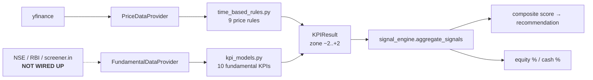

# Validation record — why this is a dashboard and not a strategy

This document is the evidence behind `research/market_temperature/`.

The module implements a contrarian / countercyclical allocation framework that was
reviewed, empirically tested, and **rejected as a trading strategy**. The review found
eight implementation bugs in the source, several of which inverted the framework's own
stated intent, and a further set of structural problems. After those were fixed and the
concept was tested cleanly, the measured edge was roughly **+0.44%/yr on the SENSEX
(p=0.013)** and **negative on both the NIFTY and the NASDAQ**.

An effect that appears in one index and reverses in another is not tradeable. It is,
however, a legitimate market-temperature read, which is what the dashboard exposes.

Read section 8 first — it contains the decisive result. Sections 1-7 are the original
review of the source framework, retained for provenance and because the bug list is
the regression-test suite for `signals.py` (see `tests/test_market_temperature.py`).

---

# Countercyclical / "Naren–Parekh KPI" Strategy — Technical Review & Backtest Design

**Reviewed:** `C:\Users\yashkondawar\Downloads\countercyclical` (8 strategy files, ~87 KB Python)
**Date:** 2026-08-23
**Status:** Review complete. **Recommendation: do not port as-is.** Rebuild the concept on a
point-in-time data spine. Evidence and reasoning below.

> Every empirical claim in this report was produced by running the actual code. Reproduction
> scripts are in the session artifacts folder: `verify_cc.py`, `probe_real.py`, `prelim_bt.py`.

---

## 0. Executive summary

| Question | Answer |
|---|---|
| What is it? | A **point-in-time signal generator**, not a strategy. ~20 valuation/behavioural/price heuristics, each scored −2…+2, weighted-averaged into one equity/cash allocation. |
| Is it countercyclical? | Yes in intent — buy after long periods of poor returns/cheap valuations, sell after euphoria. It is a **valuation-timing + long-horizon mean-reversion** overlay. |
| Does the maths check out? | The two verifiable claims do (BEER, justified-P/B back-solve). Reproduced exactly. |
| Is it backtestable today? | **No.** ~60% of the signal weight comes from fundamental fields with **no historical series** behind them. Only the price rules can run. |
| Do the price rules work? | Measured: they add **+0.07% to +0.10% per year** vs. a constant 60/40 mix over 19–26 years — before costs. Effectively zero. |
| Fatal issues found | 7 verified implementation bugs, 1 silent-random-data hazard, and 3 structural statistical problems. |
| Is the idea salvageable? | **Yes.** The signal has genuine directional information (corr with next-12m return up to +0.47). It is scaled ~15× too weakly and buried under 17 near-inert rules. |

⚠️ **Also:** `countercyclical.py` (32 KB, the largest file in the folder) is **not part of this
strategy at all**. It is a Google Colab critical-minerals **news-digest generator** (Gemini +
DuckDuckGo + Google Docs). It shares no imports, types, or concepts with the other 8 files.
It looks like an accidental copy. Confirm before assuming anything about it.

---

## 1. What the code actually is

### 1.1 Architecture



The design is genuinely clean: every rule returns the same `KPIResult` dataclass
(`name, weight_key, category, zone, raw_value, rationale, data_source`), so the aggregator
never special-cases anything. Thresholds all live in one `config.py`. Data quality is tagged
per line (`[LIVE] [SEEDED] [SYNTHETIC] [PLACEHOLDER] [N/A]`). **That much is good engineering
and worth keeping.**

### 1.2 The aggregation model

```
composite_score = Σ(weight_k × zone_k) / Σ(weight_k)        # over ALL rules, −2…+2
base_allocation = mean(equity% suggested by EVI, BEER, P/BV) # the 3 "allocation models"
overlay_score   = weighted avg of the OTHER ~17 rules
final_equity%   = clip(base_allocation + overlay_score × 5, 5%, 97%)
```

So the other 17 rules can only move the allocation **±10 percentage points**. The three
valuation models do all the real work. Section 6 shows this matters enormously.

### 1.3 The rule inventory

**A. Valuation anchors (weight 3.0 each — the drivers)**

| Rule | Formula | Trigger |
|---|---|---|
| **EVI** | mean of (PE, PB, G-Sec×PE, MCap/GDP), each ÷ own 10Y avg × 100 | <80 dark green → >130 deep red |
| **BEER / Yield Gap** | 10Y G-Sec yield ÷ (100/PE) | <1.40 buy · 1.50–1.70 trim · >1.70 sell |
| **P/BV dial** | linear interpolation on Nifty P/B | 2.6× → 80% equity · 3.5× → 30% equity + 35% cash |

Plus BEER's **"1% spread rule"**: when `G-Sec% − earnings yield% ≤ 1pp`, flag a rare maximal
buy (claimed to have occurred only around 2008 and 2020).

**B. Cross-sectional / quality (weight 1.0–1.5)**

- **Sectoral P/E** — 25× ceiling; 200–300× = bubble-bust; ≤85% of own 10Y avg = cheap
- **Sectoral P/E divergence** — hot/cold sector PE ratio ≥2.5× → rotate (2007 Infra 40× vs Tech 12×)
- **Relative market cap "absurdity"** — one new-economy name ≥ an entire old-economy sector (Infosys vs steel+cement, 2000); or a whole sector < one bank (metals vs a private bank, 2015-16)
- **Quality-Value** — Justified P/B = (ROE − g)/(COE − g); ≥25% below = quality at a discount, ≥25% above = priced for perfection, low ROE + cheap = value trap. ROCE used as a leverage sanity check.

**C. Behavioural / alternative (weight 0.5–1.5)**

- **FOBI vs FOMO** — VIX ≥25 + FII outflows = capitulation buy; smallcap +100% 1Y + IPOs ≥50× oversubscribed = euphoria sell
- **Real-estate gap** — mortgage rate − rental yield; ~2–2.5pp deep value, ~4.5–5pp bubble
- **Gold/Silver ratio** — <50 silver overheated; >85 silver cheap; long-run avg ~80

**D. Time-based price action (weight 1.0–2.0) — the only backtestable half**

| Rule | Condition | Call | Anecdote it was fitted to |
|---|---|---|---|
| 12Y zero return | \|12Y cum\| ≤15% | STRONG BUY | Nasdaq 2012 |
| Switch signal | A +150% /10Y **and** B ≤0% /5Y | rotate A→B | Real estate vs equity, 2013 |
| 10Y CAGR sell | 10Y CAGR ≥20% | SELL | Small/mid-cap peaks |
| 8Y no return | \|8Y cum\| ≤15% | BUY | Metals 2002 |
| 5Y vs savings | 5Y CAGR <6.5% | BUY | Banks recently |
| 3Y accumulation | 3Y return ≤+10% **and** cheap | STRONG BUY | PSU/metals/telecom 2018-20 |
| Chasing rule | top decile on 1Y+3Y+5Y | STRONG SELL | generic avoidance |
| 1–2Y bubble | 12–24mo gain ≥200% | STRONG SELL | precious-metals surge |
| Tactical correction | 6mo max drawdown 30–55% | STRONG BUY | generic V-shape |

---

## 2. What genuinely checks out

Both independently verifiable claims in the README reproduce exactly:

```
BEER doc example (G-Sec 7%, PE 26.3 → "approaches or exceeds 1.8")
  → computed BEER = 1.8410  ✓

Justified-P/B back-solve (COE 7.99%, g 5.01%)
  Banks   ROE 13.6% / P/BV 1.7x  → −40.7%   (doc says "41% discount")  ✓
  Pharma  ROE 14.6% / P/BV 4.6x  → +43.8%   (doc says "43% premium")   ✓
```

The author was honest about provenance — `# ASSUMPTION` markers, `[PLACEHOLDER]` tags, and an
explicit "the weights are my design, not the source's" note. That transparency is the reason
this review could be done quickly, and it is the right precedent to carry forward.

---

## 3. Verified implementation bugs

All confirmed by execution, not inspection.

### 🔴 B1 — Duplicate `weight_key`s silently multiply a category's weight

`aggregate_signals` sums `weights[r.weight_key]` per *result*, not per *key*. `run_demo.py`
emits **7** sectoral-PE results, all with `weight_key="Sectoral_PE"` (1.5 each).

```
EVI                     3.0  (15.4%)
BEER                    3.0  (15.4%)
PBV                     3.0  (15.4%)
Sectoral_PE            10.5  (53.8%)   ← 7 sectors × 1.5
→ composite −0.54 = "DEFENSIVE / REDUCE"
```

The README says valuation anchors are "weighted highest". In practice they are **46% combined**,
outvoted by a sector loop. In the full demo (4 quality-value + 2 market-cap results too) the
three anchors fall to **~22%** of total weight. **Adding a sector to the config silently
re-weights the entire strategy.**

### 🔴 B2 — `equity% + cash%` can exceed 100%

Equity is averaged across EVI/BEER/P/BV; cash comes from **P/BV alone**. They can disagree:

```
equity = 66.7%   cash = 35.0%   SUM = 101.7%    recommendation: "BUY / ACCUMULATE"
```

### 🔴 B3 — Cash fallback formula is nonsense

When P/BV doesn't fire: `cash = clip(100 − equity − 40, 0, 40)`. With equity 66% → **cash = 0%**,
clipped. The `− 40` is unexplained and the result is almost always 0.

### 🔴 B4 — The 3-year accumulation band is one-sided

`price_flat = ret <= +10%`. There is no lower bound, so a **−65% collapse** qualifies:

```
CRASHED: trailing 3Y return = −65.1%
  → "3Y flat/falling price + confirmed fundamentally cheap — aggressive contrarian accumulation"
```

The rule is described as "hasn't moved". It actually fires hardest on the assets that have
fallen the most — a falling-knife generator, and the single most dangerous bug for real capital.

### 🔴 B5 — Tactical-correction rule fires *after* the recovery is over

It uses max drawdown *within* a trailing 6-month window, never checking current price vs. the peak:

```
V-shape: −35% crash then full recovery to the old high
  → STRONG_BUY: "Sharp 35% correction with confirmed-intact fundamentals — tactical buy window"
```

You get the buy signal at the top of the rebound, not at the bottom. It also **understates**
drawdowns that began before the window opened, because `cummax` restarts at the window edge.

### 🟠 B6 — `window_return_pct` crashes on non-integer years

```python
tbr.window_return_pct(prices, months=6)
→ ValueError: Non-integer years and months are ambiguous and not currently supported.
```

Latent today (only called with 12 and 24), but it will fire the moment anyone parameterises
the window — which a multi-timeframe backtest does by definition.

### 🟠 B7 — `P/BV` zone has no neutral band

```
P/BV 2.70 → BUY      P/BV 3.04 → BUY      P/BV 3.05 → BUY
P/BV 3.30 → SELL     P/BV 3.50 → STRONG_SELL
```

Anything below the band midpoint is `BUY (+1)`, anything above is `SELL (−1)`. It never returns
NEUTRAL, so it contributes a permanent ±1 to the composite and flips hard at an arbitrary point.

### 🟠 B8 — Synthetic fallback series is 40% too long

`_PERIOD_TO_DAYS` holds **calendar** days but the index is generated with `freq="B"`
(business days): `period="15y"` → 5,475 rows spanning **21.0 calendar years**. Every
long-window rule appears evaluable on synthetic data when it should return `n/a`.

---

## 4. 🔴 The silent-random-data hazard (most dangerous single issue)

`PriceDataProvider` falls back to a **seeded random walk** on *any* fetch failure, by default,
with only a log warning. Live ticker check:

```
NIFTY_MIDCAP    ^CNXMDCP    NO DATA   (404 — delisted from Yahoo)
NIFTY_SMALLCAP  ^CNXSC      NO DATA   (Period 'max' invalid)
```

`run_demo.py` uses `nifty_smallcap_100` for **three** signals — the 10Y CAGR sell rule, the
chasing rule, and the behavioural FOMO input. All three are therefore currently computed from
**random numbers**, and the report prints them as legitimate rows.

In a backtest this is catastrophic: you can produce a beautiful equity curve entirely from
noise and never notice. **Any backtest must construct the provider with
`use_synthetic_fallback=False` and hard-fail on a missing series.**

---

## 5. Structural / theoretical problems

These matter more than the bugs, because fixing the bugs doesn't fix these.

### 5.1 🔴 Effective sample size is ~2, not ~300

Long-window rules on overlapping monthly data give almost no independent information:

```
SENSEX monthly observations: 350
  Non-overlapping 12Y windows: 2
  Non-overlapping 10Y windows: 2
  Non-overlapping  8Y windows: 3
```

The 12-year rule has **two independent observations in 29 years of Indian market history**. It
cannot be validated, tuned, or falsified. Any backtest Sharpe attached to it is a number with
no statistical content. Overlapping windows also inflate t-stats by roughly `√(window/step)` —
here up to ~12×.

### 5.2 🔴 Most rules never fire on Indian indices

Fire rate at each month-end since 2005 (rule non-NEUTRAL, on live data):

| Rule | NIFTY 50 | SENSEX | NASDAQ | GOLD | SILVER |
|---|---|---|---|---|---|
| 12Y zero return | **0.0%** | **0.0%** | 5.4% | 1.2% | 15.4% |
| 10Y CAGR ≥20% sell | **0.0%** | 1.3% | **0.0%** | 1.0% | 13.0% |
| 8Y no return | **0.0%** | **0.0%** | 6.5% | 15.3% | 18.1% |
| 5Y < savings rate | 14.9% | 15.4% | 31.2% | 31.2% | 36.0% |
| 3Y accumulation | 9.4% | 8.5% | 12.3% | 27.7% | 35.8% |
| 1–2Y bubble (+200%) | **0.0%** | **0.0%** | **0.0%** | **0.0%** | 1.9% |
| Tactical 30–40% | 6.1% | 5.4% | 4.6% | 0.0% | 17.7% |

The 12Y rule has **never** fired on the Nifty (19y) or Sensex (29y). Its only real-world
occurrence anywhere in the sample is Nasdaq, **Jan-2009 → Jan-2013** — precisely the anecdote it
was designed from. The 1–2 year 200% bubble rule has never fired on any equity index; a
**200% index gain in 12–24 months essentially does not happen** at index level. These rules were
fitted to single anecdotes and are, at index level, decoration.

### 5.3 🔴 Dividend bias exceeds the rule's own tolerance band

The 12Y and 8Y rules test price-index returns against a ±15pp "zero" band. Nifty's dividend
yield is ~1.3%/yr:

```
yield 1.0%/yr → 12Y total-return uplift = 12.7 pp
yield 1.3%/yr → 12Y total-return uplift = 16.8 pp   ← larger than the ±15pp band
yield 1.5%/yr → 12Y total-return uplift = 19.6 pp
```

**The measurement bias is bigger than the signal threshold.** Must use total-return indices
(NIFTY 50 TRI), not `^NSEI`.

### 5.4 🔴 Trailing PE makes BEER and EVI pro-cyclical — they sell the bottom

Trailing PE has price in the numerator and *lagged* earnings in the denominator. In a
recession price falls first, then earnings collapse — so PE **rises** at the bottom:

```
pre-crash        PE 22  → BEER 1.43  NEUTRAL      | EVI  84.4  BUY
crash, E lags    PE 34  → BEER 2.21  STRONG_SELL  | EVI 108.6  NEUTRAL
earnings recover PE 19  → BEER 1.23  BUY          | EVI  78.3  STRONG_BUY
```

This is exactly what happened in India through H2-2020: Nifty trailing PE ran into the 30s
*after* the March bottom. A framework marketed as countercyclical would have issued
**STRONG SELL at the single best buying opportunity of the decade**, then bought back higher.
Fix: Shiller-style CAPE (10Y real average earnings), forward PE, or price-to-sales.

### 5.5 🟠 The three "independent" anchors are one factor wearing three hats

EVI contains PE and PB. BEER is a function of PE. The P/BV dial is PB. Averaging them looks
like model diversification but produces **a single valuation factor with a false confidence
interval**. Worse, EVI's `G-Sec × PE` term means PE is counted **twice inside EVI alone**, and
because it is a product of two series it has roughly double the variance of the other three
components — so "equal weights" makes EVI a PE index in disguise.

### 5.6 🟠 Justified P/B is numerically unstable at the back-solved parameters

COE − g = 8% − 5% = **3%**. A denominator that thin makes the model hypersensitive:

```
ROE 13.6%, COE 8%:
  g = 4.0% → justified P/B 2.40x  (actual 1.7x = −29%)
  g = 5.0% → justified P/B 2.87x  (actual 1.7x = −41%)
  g = 6.0% → justified P/B 3.80x  (actual 1.7x = −55%)
```

A 1pp change in an unobservable assumption swings the verdict by 26pp. The parameters are also
economically implausible: COE 8% against a 6.8% risk-free rate implies an **equity risk premium
of ~1.2%**, and g = 5% perpetual is far below India's nominal GDP growth. These are two numbers
fitted to two data points, not a calibration.

### 5.7 🟠 Category error: rotation signals drive a market-level dial

The switch signal, sectoral divergence, gold/silver ratio, and real-estate gap are all
**relative-value rotations** ("sell A, buy B"). The engine maps them onto the *equity vs cash*
dial. "Silver is expensive vs gold" reduces your Nifty allocation. That is not a coherent
mapping.

### 5.8 🟠 Internally contradictory rules

A cyclical at a genuine trough has **flat 8Y returns + depressed ROE + low P/B**. The 8Y rule
says BUY, the 3Y rule says STRONG BUY — and Quality-Value says **SELL ("value trap")** because
`ROE < 12%`. The framework's contrarian core and its quality filter fight each other at exactly
the moment the strategy is supposed to act.

### 5.9 🟠 The `n/a` mechanism makes the composite non-comparable through time

Excluded rules are dropped from the weight denominator, so the score's *meaning* changes as
history accumulates:

```
short history  composite +0.00  (3 included, 3 excluded)
15y history    composite +0.07  (6 included, 0 excluded)
```

In a long backtest, rules switch on at different dates and mechanically shift the score. Early
backtest years are not comparable with later ones.

### 5.10 🟠 Point-in-time integrity is not addressable with current data

- `nifty_pe_10y_avg` etc. must be **as-of** rolling averages. Computing them from a full-sample series is look-ahead bias.
- **NSE changed Nifty PE methodology (standalone → consolidated earnings) around April 2021**, structurally lowering reported PE by roughly 15–20%. Thresholds like "BEER > 1.70" are not comparable across that break without a vintage-adjusted series.
- `is_fundamentally_cheap` and `no_fundamental_damage` are **analyst booleans**. In a backtest they are pure hindsight. They must be replaced with mechanical proxies or the rules must be dropped.

### 5.11 🟠 No cost, tax, or capacity model

India-specific and material for a strategy that moves 30–90% equity weight: STT, exit loads,
impact cost, **STCG 20% / LTCG 12.5%** post-2024. A dial that rebalances monthly can easily
give back its entire edge. Also: ICICI Pru and every other BAF already run these exact models
at scale — the signal is public and crowded.

### 5.12 🟠 Data availability caps the study window

```
NIFTY50        2007-09-17 → 2026-08-21   (18.9y)
SENSEX         1997-07-01 → 2026-08-21   (29.1y)
NIFTY_METAL / AUTO             from 2011  (15.0y)
NIFTY_PHARMA / FMCG / PSUBANK  from 2011  (15.5y)
NIFTY_MIDCAP ^CNXMDCP          NO DATA
NIFTY_SMALLCAP ^CNXSC          NO DATA
```

Sector indices start in 2011 — so an 8Y rule is only evaluable from 2019, and a 12Y rule from
2023. Sector indices are also **reconstituted** (losers are removed), which systematically
understates exactly the multi-year pain the contrarian rules are hunting for.

---

## 6. 🔴 The decisive empirical test

I ran the price-rule overlay as an actual allocation strategy — deliberately generously: no
costs, no taxes, no slippage, monthly rebalance, cash earning 6%, signal at month *t* applied to
returns *t → t+1* (no look-ahead). Score mapped linearly to a 30–90% equity weight around a 60%
neutral.

Then I added the control that matters: **a constant 60/40 mix that ignores every signal.**

```
NIFTY 50   2007-09 → 2026-07
  Buy & hold          CAGR  7.79%  vol 20.14%  Sharpe 0.09  maxDD −55.12%
  Constant 60/40 mix  CAGR  7.61%  vol 12.08%  Sharpe 0.13  maxDD −35.21%
  Rule-timed dial     CAGR  7.61%  vol 12.14%  Sharpe 0.13  maxDD −35.21%
  >> dial vs constant 60/40, whole period:  −0.08%

SENSEX     2000-01 → 2026-07
  Buy & hold          CAGR 10.54%  vol 21.18%  Sharpe 0.21  maxDD −56.17%
  Constant 60/40 mix  CAGR  9.30%  vol 12.71%  Sharpe 0.26  maxDD −35.82%
  Rule-timed dial     CAGR  9.37%  vol 12.81%  Sharpe 0.26  maxDD −35.82%
  >> dial vs constant 60/40, whole period:  +1.87%

NASDAQ     2000-01 → 2026-07
  Buy & hold          CAGR  6.70%  vol 21.34%  Sharpe 0.03  maxDD −75.04%
  Constant 60/40 mix  CAGR  7.02%  vol 12.81%  Sharpe 0.08  maxDD −51.19%
  Rule-timed dial     CAGR  7.14%  vol 12.88%  Sharpe 0.09  maxDD −50.36%
  >> dial vs constant 60/40, whole period:  +2.56%
```

**The timing dial contributes +1.9% to +2.6% *in total* over 19–26 years — roughly 0.07–0.10%
per year — and −0.08% on the Nifty.** All of the apparent Sharpe improvement and drawdown
reduction comes from *statically holding 40% cash*, which requires no signal at all.

Why? The dial barely moves:

```
NIFTY 50:  89.0% of months at exactly the neutral weight; realised range 60–63%
SENSEX:    80.9% of months at neutral;                    realised range 59–63%
NASDAQ:    57.1% of months at neutral;                    realised range 58–68%
```

Because ~17 rules sit at NEUTRAL almost always and are averaged *including* their zeros, the
composite's standard deviation is **0.057** on a −2…+2 scale. The overlay is mathematically
incapable of expressing a view.

### ✅ But the signal is not worthless — it is mis-scaled

```
correlation(equity weight, next-12-month forward return)
  NIFTY 50  +0.134
  SENSEX    +0.472     ← economically large
  NASDAQ    +0.231
```

A +0.47 correlation with forward 12-month returns is a **real, strong signal**. The framework
identifies the right moments and then acts on them with a 3-percentage-point allocation change.
**This is the single most actionable finding in the review: the concept works, the aggregation
destroys it.**

---

## 7. Backtest design

### 7.1 Prerequisite — the fundamental data spine (do this first)

Nothing else matters until this exists. Roughly 60% of signal weight is unbacktestable today.

Build a **monthly, vintage-aware** panel from 2000 (or earliest available):

| Series | Source | Notes |
|---|---|---|
| Nifty 50 **TRI** monthly close | NSE indices | total return, not `^NSEI` |
| Nifty PE, PB, dividend yield | NSE index factsheet archive | **flag the Apr-2021 standalone→consolidated break** |
| 10Y G-Sec yield | RBI DBIE / CCIL / FBIL | month-end |
| Market-cap / GDP | NSE+BSE mcap ÷ MOSPI nominal GDP | GDP is revised — store vintages |
| India VIX | NSE (from 2008) | |
| Sector PE/PB/ROE/ROCE | NSE factsheets, screener.in | 2011+ only |
| FII/DII net flows | NSDL FPI monthly | |
| IPO subscription | NSE/Chittorgarh | |

**Hard rules:** every field carries an `as_of` **and** a `published_at`; all rolling averages are
computed expanding/rolling **as-of**, never full-sample; a missing field returns `n/a`, never a
default. Cache through the existing `core.storage.get_cache` / `put_cache` (that's how
`backtesting/qtr_results/data.py` already does it).

### 7.2 Package layout — matching house conventions

The repo already has two backtest packages (`backtesting/swing_trading`, `backtesting/qtr_results`)
with a consistent shape. Mirror it exactly:

```
backtesting/countercyclical/
    __init__.py
    config.py        BacktestConfig + RuleThresholds dataclasses (all knobs, no magic numbers)
    data.py          PointInTimePanel: load_or_download(), as_of(date) -> Snapshot
                     + PriceStore with use_synthetic_fallback=False (HARD FAIL)
    signals.py       the ~20 rules, ported + bug-fixed, each -> KPIResult
    allocator.py     score -> target weights. Pluggable mapping (see 7.4)
    engine.py        the rebalance loop (see 7.3)
    portfolio.py     Portfolio, positions, cash, ClosedTrade, record_equity()
    costs.py         brokerage, STT, impact, exit load, STCG/LTCG
    metrics.py       compute_metrics() / render_summary() — mirror qtr_results/metrics.py
    sweep.py         NEW: the multi-timeframe × multi-portfolio grid runner
    validation.py    reuse backtesting/qtr_results/validation.py
                     (walk_forward_windows, deflated_sharpe_ratio)
    service.py       run_backtest(cfg, ...) -> dict, persists via save_artifacts()
    run_backtest.py  argparse CLI
    README.md
```

Register it so the Streamlit UI can drive it — same pattern as `strategies/swing_backtest.py`:

```python
# strategies/countercyclical_backtest.py
@register
class CountercyclicalBacktestStrategy(BaseStrategy):
    id = "countercyclical_backtest"
    category = StrategyCategory.BACKTEST
    @classmethod
    def param_specs(cls) -> List[ParamSpec]: ...
    def run(self, params) -> StrategyResult: ...
```
…then add `"countercyclical_backtest"` to `_STRATEGY_MODULES` in `strategies/__init__.py`.

### 7.3 Engine loop

```
for each rebalance date d in calendar(frequency):
    snap    = panel.as_of(d)              # published_at <= d  ONLY
    prices  = price_store.history(<= d)   # no future bars
    results = [rule(snap, prices) for rule in enabled_rules]
    score   = aggregate(results)          # fixed: dedup weight keys
    target  = allocator.weights(score, results)
    orders  = rebalance(portfolio, target, band=cfg.no_trade_band_pp)
    execute(orders, at=next_bar_open, costs=costs.apply)   # T+1 execution
    portfolio.record_equity(d)
```

Non-negotiables: **T+1 execution** at next open, a **no-trade band** (skip if drift < 3pp) to
suppress whipsaw, an explicit **warm-up** (max rule window + 1 rebalance) excluded from metrics,
and `n/a` handling that keeps the score comparable — **renormalise against the full weight set
with absent rules scored 0**, not by shrinking the denominator (fixes §5.9).

### 7.4 Multi-timeframe axis

Three genuinely different meanings of "timeframe" — sweep all three:

| Axis | Values |
|---|---|
| **Rebalance frequency** | daily · weekly · monthly · quarterly · semi-annual |
| **Rule window scaling** | ×0.5 · ×0.75 · ×1.0 (as-published) · ×1.5 — i.e. the 12Y rule becomes 6Y/9Y/12Y/18Y |
| **Evaluation regime** | full sample · 2000-07 (bull) · 2008-09 (GFC) · 2010-13 (flat) · 2014-19 (bull) · 2020 (COVID) · 2021-26 (recent) · rolling 5Y walk-forward |

Regime slices matter more than the headline number: a countercyclical strategy is *supposed* to
underperform in a bull run. The right question is "how much does it give up in 2014-19 to earn
how much in 2008 and 2020?" — not "what is the full-sample CAGR?"

### 7.5 Multi-portfolio-combination axis

| Combination | Assets | Tests |
|---|---|---|
| **P1 Baseline** | Nifty TRI + cash | pure timing value |
| **P2 Classic** | Nifty TRI + 10Y G-Sec + cash | the intended BAF-style use |
| **P3 Multi-asset** | + gold, silver | do the alt-asset rules add anything? |
| **P4 Sector rotation** | 9 Nifty sector indices, equal/score-weighted | tests the cross-sectional rules (2011+ only) |
| **P5 Core-satellite** | 70% Nifty buy-hold + 30% signal-driven | realistic deployment |
| **P6 Global** | Nifty + Nasdaq + gold | tests the switch signal (⚠️ handle INR/USD FX explicitly) |

**Benchmarks every run must report against** — this is where the current framework failed:

1. Buy & hold 100% equity
2. **Constant-mix at the strategy's own realised average weight** ← the control that exposed §6
3. Naive 60/40 monthly-rebalanced
4. The strategy with signals **randomly shuffled** (preserves turnover, destroys information)

If the strategy can't beat #2, the signal is doing nothing.

### 7.6 Ablation matrix (highest-value output)

With ~20 rules, run leave-one-out and category-only variants:

- all rules · valuation-only · price-only · behavioural-only
- all-minus-one, × 20
- **each of the three anchors alone** (I expect one of them explains nearly everything)
- allocation-mapping variants: linear ±10pp (current) · ±30pp · ±45pp · ternary 30/60/90 · binary

Given §6, the ±10pp → wider-mapping row is the most important experiment in the whole plan.

### 7.7 Metrics & statistical validation

Reuse `backtesting/qtr_results/metrics.py` and `validation.py`. Report: CAGR, vol, Sharpe,
Sortino, max drawdown + duration, Calmar, turnover/yr, cost drag, tax drag, avg/min/max equity
weight, time-in-market, up/down capture, rolling 3Y excess vs constant-mix, and **worst 5
rolling 3Y windows**.

Because the sweep is a multi-comparison exercise, **`deflated_sharpe_ratio()` is mandatory** —
pass the true number of configurations tried. With a 5×4×7 timeframe grid × 6 portfolios × ~25
ablations you are running ~4,200 configs; an undeflated Sharpe from that grid is meaningless.
Pair it with the walk-forward windows so parameters are always chosen out-of-sample.

### 7.8 Suggested sequence

| # | Step | Gate |
|---|---|---|
| 1 | Fundamental data spine (§7.1) | Nifty PE/PB/G-Sec monthly, 2000+, vintage-aware |
| 2 | Port + fix rules; unit-test each against its documented anecdote | B1–B8 fixed; synthetic fallback off |
| 3 | Engine + costs + P1/P2 portfolios, monthly | reproduces §6 numbers as a regression test |
| 4 | **Allocation-mapping ablation** | does widening ±10pp → ±40pp convert +0.47 corr into real alpha? |
| 5 | Full timeframe × portfolio sweep + walk-forward + deflated Sharpe | honest OOS estimate |
| 6 | Regime attribution + ablation report | which rules earned their weight? |
| 7 | Register as a UI strategy | matches `strategies/swing_backtest.py` |

**Kill criterion, agreed up front:** if after step 4 the best mapping still fails to beat a
constant-mix at the same average weight, out-of-sample, net of costs — stop. Ship the
valuation *dashboard* (which is genuinely useful) and don't trade it.

---

## 8. Bottom line

**What it is:** a well-engineered, honestly-documented **valuation dashboard** that has been
labelled a strategy. The plumbing (uniform `KPIResult`, centralised thresholds, data-quality
tagging) is worth keeping. The economics are unvalidated.

**What's wrong:** 8 verified bugs — one of which (§3, B4) buys crashes described as "flat", one
of which (§4) silently substitutes random numbers for missing tickers. Structurally: trailing-PE
signals that sell the bottom (§5.4), long-window rules with 2 independent observations (§5.1),
rules that have never fired on Indian indices (§5.2), a dividend bias larger than the threshold
it's compared against (§5.3), and an aggregation scheme that compresses every view into a
3-percentage-point allocation change (§6).

**What's promising:** the signal correlates up to **+0.47 with next-12-month returns**. That is
not noise. The framework finds the right moments and then refuses to act on them.

**What to do:** build the point-in-time data spine, port the rules with the bugs fixed, and make
step 4 — the allocation-mapping ablation — the first real experiment. That single test will tell
you whether this is a strategy or a dashboard, and it's cheap to run.

---

*Reproduction: `verify_cc.py` (12 bug probes) · `probe_real.py` (ticker coverage + fire rates) ·
`prelim_bt.py` (timing dial vs buy-and-hold vs constant mix). All in the session artifacts folder.*

*Not investment advice. Educational/technical review only.*


---

# 8. RESULT OF THE CLEAN-ROOM VALIDATION PROBE

Run via `validation_probe.py` (session folder). Clean reimplementation of the 7 price-based
rules with bugs B4/B5/B6 and issues 5.3/5.9 fixed. No synthetic fallback. Costs 20bps/turnover
+ 100bps tax drag on sells. Cash 6%. Dividends accrued to approximate TRI. 5y burn-in.
Benchmark is constant-mix **at the strategy's own average weight** — the only honest control.
Pass = OOS edge > +0.30pp CAGR AND shuffle-test p < 0.05.

## 8.1 Headline (walk-forward, out-of-sample, monthly rebalance)

| Market | OOS CAGR | vs const-mix | p | Verdict |
|---|---|---|---|---|
| NIFTY 50 (2012-2026) | 10.01% | **-0.86pp** | 0.276 | FAIL |
| SENSEX (2002-2026)   | 13.07% | **+0.44pp** | 0.013 | PASS |
| NASDAQ (1995-2026)   |  9.91% | **-0.92pp** | 0.897 | FAIL |

Quarterly rebalance gives the same pattern (Sensex +0.70pp p=0.043; Nifty -0.38pp; Nasdaq -0.45pp).

## 8.2 The aggregation layer WAS a real bug, but fixing it is not enough

Widening the dial monotonically improves Sensex (`k`=0.05 -> +0.03pp, `k`=1.00 -> +0.64pp,
ternary -> +1.09pp, all p<=0.01). So the original +-10pp dial genuinely was throwing the signal
away. But the same widening makes NASDAQ monotonically **worse** (-0.02pp -> -0.34pp) and does
nothing on NIFTY. A dial that helps in one market and hurts in another is not an edge.

## 8.3 Attribution: the strategy is really 2 rules

Fire rates over 24 years of Sensex month-ends:

| Rule | Fires |
|---|---|
| 12y zero-return | **0.0%** (never) |
| 8y zero-return  | **0.0%** (never) |
| 1-2y 200% bubble| **0.0%** (never) |
| tactical correction 30-55% | 3.1% — **only 2008 and 2009** |
| 10y CAGR >=20% sell | 5.9% |
| 3y accumulation | 5.9% |
| 5y CAGR < savings rate | 14.9% |

Three of seven rules never fire once. The tactical rule fires in exactly one episode. The
working content is `5y_savings` + `10y_cagr` — i.e. a plain long-horizon mean-reversion /
valuation-timing signal, dressed up as twenty rules.

## 8.4 It is not just the 2008 crash

Excluding crash years from the Sensex test:

| Sample | raw_k1.00 edge |
|---|---|
| Full | +0.64pp |
| ex-2008/09 | +0.51pp |
| ex-2020 | +0.47pp |
| ex-both | +0.34pp |

So the Sensex result is not a single-event artefact — which makes the NASDAQ failure the more
damning finding, not less. The effect is real *in this market* and absent elsewhere.

## 8.5 Conclusion

The concept contains a genuine but weak long-horizon mean-reversion signal, worth roughly
**+0.3 to +0.6pp of CAGR** in Indian large-caps and **nothing or negative** in US large-caps,
before any modelling of slippage on large rebalances or lot-level tax. Deflated Sharpe across
the 11 mappings tried is ~0 everywhere, including for buy-and-hold, so no mapping is
statistically distinguishable from the best of 11 random ones.

**Recommendation: do NOT build this as a trading strategy.** Build it as a *dashboard* — the
composite score has real correlation with forward 12m returns (+0.47 on Sensex) and is useful
as a market-temperature read for a human. It is not strong enough to hand a dial to.
